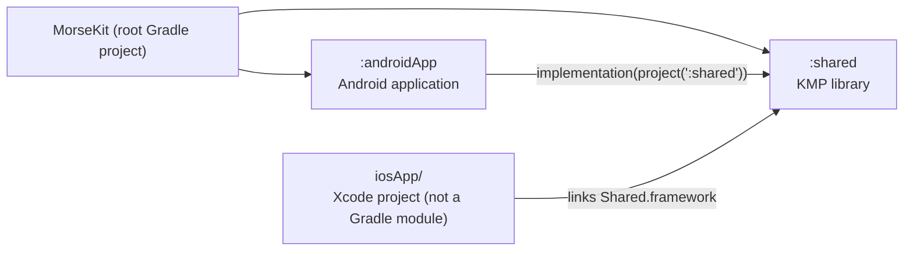
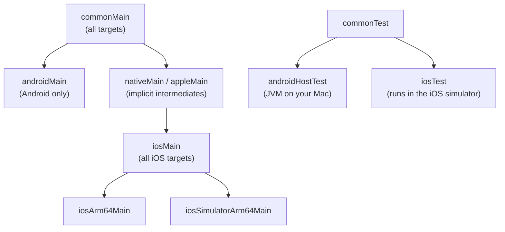
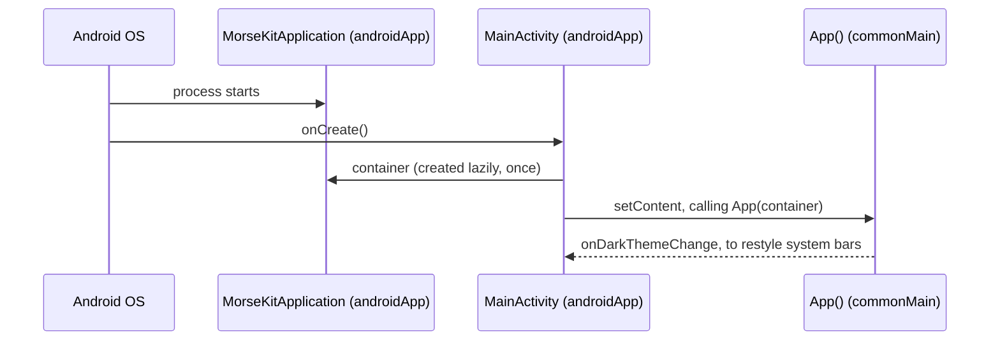
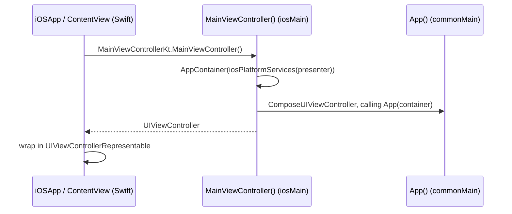

# 1. KMP project structure

## Modules



| Module | Plugin(s) | Role |
| --- | --- | --- |
| `shared` | `kotlinMultiplatform`, `com.android.kotlin.multiplatform.library`, `composeMultiplatform`, `composeCompiler` | All shared logic **and** all UI |
| `androidApp` | `com.android.application`, `composeCompiler` | A thin shell: `MainActivity` calls `App(...)` |
| `iosApp` | none (Xcode) | A thin shell: SwiftUI `ContentView` hosts `MainViewController()` |

Both apps are intentionally thin: almost everything is in `shared`, so both platforms get it.

> **Concept: `com.android.kotlin.multiplatform.library`.** This is AGP's KMP-specific Android
> library plugin. Instead of a separate `android { }` block with build types and flavors, the
> Android target is configured *inside* `kotlin { android { ... } }` in
> `shared/build.gradle.kts`. It's simpler and has one variant.

## Targets

`shared/build.gradle.kts` declares three targets:

| Target | Compiler | Output | Used by |
| --- | --- | --- | --- |
| `android` | Kotlin/JVM | Android library (AAR-like) | `androidApp` |
| `iosArm64` | Kotlin/Native | `Shared.framework` (static) | Real iPhones |
| `iosSimulatorArm64` | Kotlin/Native | `Shared.framework` (static) | Simulator on Apple-silicon Macs |

```kotlin
listOf(iosArm64(), iosSimulatorArm64()).forEach { iosTarget ->
    iosTarget.binaries.framework {
        baseName = "Shared"   // Swift does `import Shared`
        isStatic = true       // linked into the app binary, no embedded dylib
    }
}
```

> **Concept: Kotlin/Native.** iOS can't run a JVM, so Kotlin compiles iOS code to native machine
> code with LLVM and exposes it to Swift/Obj-C as a framework. Kotlin/Native can call Apple
> frameworks directly (`platform.UIKit.*`, `platform.AVFoundation.*`, ...).

## Source sets

A source set is a folder of code plus the targets it compiles for. KMP's *default hierarchy
template* creates these automatically:



| Source set | Can use | In this project |
| --- | --- | --- |
| `commonMain` | Kotlin stdlib + multiplatform libraries (Compose, lifecycle) | Engine, UI, ViewModels, platform *interfaces* |
| `androidMain` | Everything in common + Android SDK (`android.*`, `androidx.*`) | `androidPlatformServices()` |
| `iosMain` | Everything in common + Apple frameworks (`platform.*`) | `iosPlatformServices()`, `MainViewController` |
| `commonTest` | `kotlin.test` + everything in `commonMain` | All current tests |

**Rule of thumb:** write code in `commonMain` unless it *has* to touch a platform API.

## Where our files live

```
shared/src/
├── commonMain/
│   ├── composeResources/drawable/   ← vector icons (Compose resources)
│   └── kotlin/in/geekofia/morsekit/
│       ├── App.kt                   ← shared entry composable
│       ├── core/{model,morse,timing}/
│       ├── feature/{translator,reference,settings}/
│       ├── navigation/
│       ├── platform/                ← interfaces
│       └── ui/{theme,components}/
├── androidMain/kotlin/.../platform/AndroidPlatformServices.kt
├── iosMain/kotlin/.../
│   ├── MainViewController.kt        ← iOS entry point called from Swift
│   └── platform/IosPlatformServices.kt
└── commonTest/kotlin/.../           ← tests mirroring the main packages
```

> **Why `` `in` `` in the package name?** `in` is a Kotlin keyword, so the package
> `in.geekofia.morsekit` has to be written `` package `in`.geekofia.morsekit `` in source files.

## How each platform starts the app





> **Concept: how Swift sees Kotlin.** Top-level Kotlin functions become static methods on a class
> named after the file: `MainViewController.kt` → `MainViewControllerKt`. That's why Swift calls
> `MainViewControllerKt.MainViewController()`.

> **How Xcode builds Kotlin.** The Xcode project has a *Run Script* build phase that runs
> `./gradlew :shared:embedAndSignAppleFrameworkForXcode`. Building in Xcode therefore compiles
> the Kotlin framework for the selected device/simulator first.

## Gradle configuration

| File | Purpose |
| --- | --- |
| `settings.gradle.kts` | Declares repositories and the `:androidApp` / `:shared` modules |
| `build.gradle.kts` (root) | Declares plugins with `apply false` so they load once |
| `gradle/libs.versions.toml` | **Version catalog**: every dependency and version in one place, accessed as `libs.xyz` |
| `gradle.properties` | JVM memory, configuration cache, build cache, AndroidX flags |
| `gradle/gradle-daemon-jvm.properties` | Asks Gradle to run on a JDK 21 (Azul), auto-downloaded if missing |
| `shared/build.gradle.kts` | Targets, Android config, per-source-set dependencies |

Dependencies are declared **per source set**:

```kotlin
sourceSets {
    commonMain.dependencies {
        implementation(libs.compose.material3)
        implementation(libs.androidx.lifecycle.viewmodelCompose)
        // ...
    }
    commonTest.dependencies {
        implementation(libs.kotlin.test)
    }
}
```

A library in `commonMain` must itself be multiplatform (publish Android *and* iOS variants).
That's why Compose and lifecycle come from `org.jetbrains.*` coordinates: those are
JetBrains' multiplatform builds of the AndroidX libraries.

### Dependencies MorseKit uses (all from the project generator, nothing added)

| Library | Why we use it |
| --- | --- |
| `compose.runtime/foundation/ui/material3` | Shared UI |
| `compose.components.resources` | `Res.drawable.*` icons shared across platforms |
| `lifecycle-viewmodel-compose` | `ViewModel` + `viewModel { }` in common code |
| `lifecycle-runtime-compose` | Lifecycle-aware Compose helpers (available, not used yet) |
| `kotlin-test` | Multiplatform test assertions |
