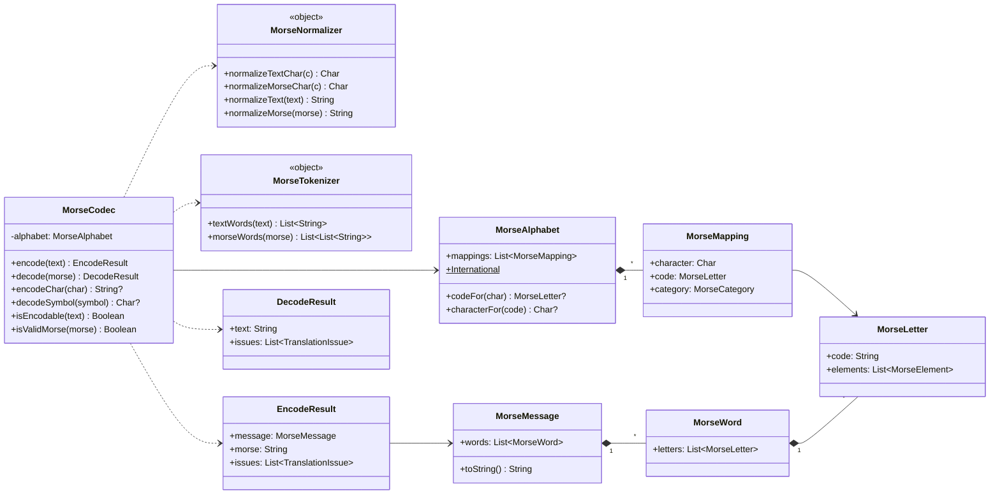
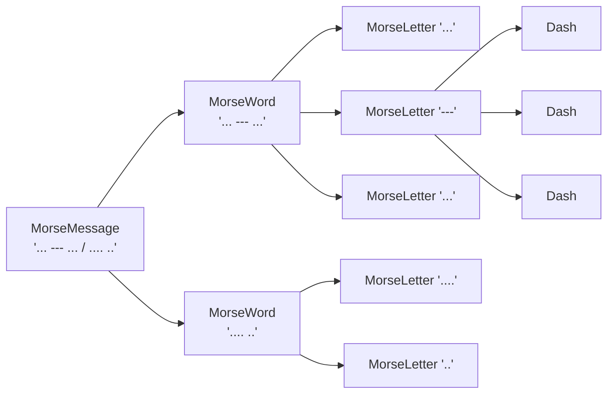
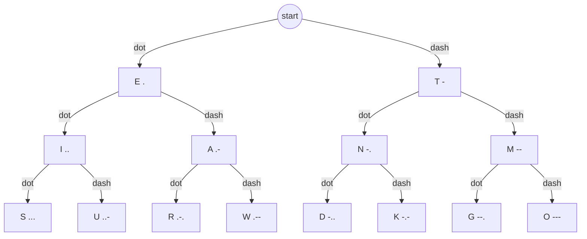
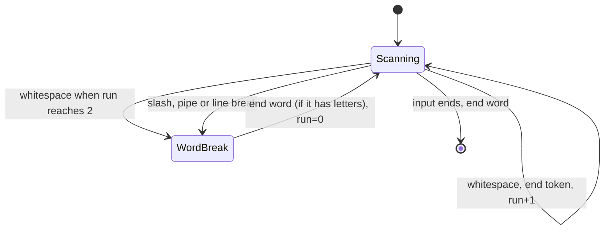
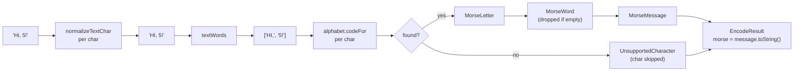
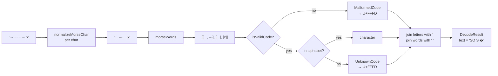

# 2. The Morse engine

All code here lives in `shared/src/commonMain/kotlin/in/geekofia/morsekit/core/`. It's plain
Kotlin, with no Compose and no Android or iOS APIs, so it compiles unchanged for every target.

## The pieces

| File | Type | Responsibility |
| --- | --- | --- |
| `model/MorseNotation.kt` | `object` of constants | The canonical symbols: `.` `-`, letter separator `" "`, word separator `" / "` |
| `model/MorseElement.kt` | `enum` | `Dot` / `Dash` |
| `model/MorseMessage.kt` | `data class`es | `MorseLetter` → `MorseWord` → `MorseMessage` (structured Morse) |
| `morse/MorseAlphabet.kt` | `class` | The single character ↔ code table (`International`) |
| `morse/MorseNormalizer.kt` | `object` | Cleans up input characters (case, smart quotes, fancy dots and dashes) |
| `morse/MorseTokenizer.kt` | `object` | Splits input into words and letters |
| `morse/MorseCodec.kt` | `class` | The public API: `encode`, `decode`, and helpers |
| `morse/TranslationResult.kt` | `data class`es + `sealed interface` | `EncodeResult`, `DecodeResult`, `TranslationIssue` |



## The data model: text vs structured Morse

Morse has three levels, and the model mirrors them:



`toString()` on each level produces the canonical text form by joining with `MorseNotation`
separators:

| Level | Joined with | Example |
| --- | --- | --- |
| `MorseLetter` | (its code) | `...` |
| `MorseWord` | `LETTER_SEPARATOR` = `" "` | `... --- ...` |
| `MorseMessage` | `WORD_SEPARATOR` = `" / "` | `... --- ... / .... ..` |

> **Concept: invariants in `init`.** `MorseLetter` runs `require(isValidCode(code))` in its
> `init` block, and `MorseWord` requires at least one letter. You *cannot* construct an invalid
> letter or an empty word, so no other code needs to check. This is "make illegal states
> unrepresentable".

> **Concept: `data class`.** You get `equals`, `hashCode`, `copy` and `componentN` for free.
> Equality is by value, which is why `MorseLetter` can be a `Map` key in `MorseAlphabet` and
> why tests can `assertEquals` whole results. All properties are `val`, so the models are
> immutable.

## The alphabet

`MorseAlphabet.International` is the **only** place mappings are defined. It builds two hash
maps once (`codeByChar` and `charByCode`), so every lookup takes constant time. The `init`
block rejects duplicate characters **and** duplicate codes, so the table is guaranteed to be
reversible.

| Category | Characters | Count |
| --- | --- | --- |
| Letter | `A`–`Z` | 26 |
| Digit | `0`–`9` | 10 |
| Punctuation (ITU) | `. , ? ' / ( ) : = + - " @` | 13 |
| Punctuation (common, non-ITU) | `! & ; _ $` | 5 |

<details>
<summary>Full table</summary>

| Char | Code | Char | Code | Char | Code |
| --- | --- | --- | --- | --- | --- |
| A | `.-` | M | `--` | Y | `-.--` |
| B | `-...` | N | `-.` | Z | `--..` |
| C | `-.-.` | O | `---` | 0 | `-----` |
| D | `-..` | P | `.--.` | 1 | `.----` |
| E | `.` | Q | `--.-` | 2 | `..---` |
| F | `..-.` | R | `.-.` | 3 | `...--` |
| G | `--.` | S | `...` | 4 | `....-` |
| H | `....` | T | `-` | 5 | `.....` |
| I | `..` | U | `..-` | 6 | `-....` |
| J | `.---` | V | `...-` | 7 | `--...` |
| K | `-.-` | W | `.--` | 8 | `---..` |
| L | `.-..` | X | `-..-` | 9 | `----.` |
| `.` | `.-.-.-` | `,` | `--..--` | `?` | `..--..` |
| `'` | `.----.` | `!` | `-.-.--` | `/` | `-..-.` |
| `(` | `-.--.` | `)` | `-.--.-` | `&` | `.-...` |
| `:` | `---...` | `;` | `-.-.-.` | `=` | `-...-` |
| `+` | `.-.-.` | `-` | `-....-` | `_` | `..--.-` |
| `"` | `.-..-.` | `$` | `...-..-` | `@` | `.--.-.` |

</details>

### Seeing the alphabet as a tree

Every code is a path: dot = go left, dash = go right. Common letters have short paths, which is
why E is `.` and T is `-`. (This is only a way to picture it; the code uses hash maps, not a
tree.)



## Normalization: cleaning input first

Real input is messy. Phone keyboards insert "smart" punctuation (iOS turns `'` into `’`), and
Morse copied from websites often uses `·` and `−` instead of `.` and `-`. `MorseNormalizer`
maps each character **independently** before any splitting happens.

### Text characters (`normalizeTextChar`)

| Input | Output | Why |
| --- | --- | --- |
| `a`–`z` | `A`–`Z` | The alphabet stores upper case only |
| `‘ ’ ‚ ′` | `'` | Smart single quotes / prime |
| `“ ” „ ″` | `"` | Smart double quotes / double prime |
| anything else | unchanged | Including `é`, `ı`, `#`; the alphabet decides later whether it's supported |

> **Why only ASCII upper-casing?** `'ı'.uppercaseChar()` (Turkish dotless i) returns `'I'`, so a
> general `uppercaseChar()` would silently encode `ı` as `I`. Restricting to `a..z` keeps
> behaviour predictable, and `ı` is correctly reported as unsupported.

### Morse characters (`normalizeMorseChar`)

| Input | Output |
| --- | --- |
| `·` (U+00B7), `•` (U+2022), `∙` (U+2219), `⋅` (U+22C5) | `.` |
| `−` (U+2212), `–` (U+2013), `—` (U+2014), `‒` (U+2012), `_` | `-` |
| anything else | unchanged |

`normalizeText(text)` and `normalizeMorse(morse)` combine this character mapping with
tokenizing and re-join the result into canonical form, e.g. `"  hello   world "` →
`"HELLO WORLD"` and `"•••   ———|···"` → `"... / --- / ..."`.

## Tokenizing: finding words and letters

### Text

`MorseTokenizer.textWords` splits on **any run of whitespace** (spaces, tabs, newlines,
non-breaking spaces) and drops empty pieces. `/` is *not* a separator in text; it's a character
to encode (`-..-.`).

### Morse

Morse needs two levels of separation. The rules:

| Separator | Meaning |
| --- | --- |
| a single whitespace character | next **letter** |
| `/` or `\|` | next **word** |
| a line break (`\n` or `\r`) | next **word** |
| two or more whitespace characters in a row | next **word** |

Empty words are dropped, so `". / / -"` and `" / ... / "` behave sensibly.

`morseWords` is a small **state machine** that scans the input one character at a time. It keeps
a `token` being built, the `letters` of the current word, the finished `words`, and a
`whitespaceRun` counter:



Here `endToken()` moves `token` into `letters` if it's non-empty, and `endWord()` calls
`endToken()` and then moves `letters` into `words` if it's non-empty.

### Trace: `"... --  .|x"`

| # | Char | Action | `token` | `letters` | `words` | run |
| --- | --- | --- | --- | --- | --- | --- |
| 1 | `.` | append | `.` | `[]` | `[]` | 0 |
| 2 | `.` | append | `..` | `[]` | `[]` | 0 |
| 3 | `.` | append | `...` | `[]` | `[]` | 0 |
| 4 | space | end token | | `[...]` | `[]` | 1 |
| 5 | `-` | append | `-` | `[...]` | `[]` | 0 |
| 6 | `-` | append | `--` | `[...]` | `[]` | 0 |
| 7 | space | end token | | `[..., --]` | `[]` | 1 |
| 8 | space | run = 2, so **end word** | | `[]` | `[[..., --]]` | 2 |
| 9 | `.` | append | `.` | `[]` | `[[..., --]]` | 0 |
| 10 | `\|` | **end word** | | `[]` | `[[..., --], [.]]` | 0 |
| 11 | `x` | append (not validated here) | `x` | `[]` | `[[..., --], [.]]` | 0 |
| end | | end word | | | `[[..., --], [.], [x]]` | |

The tokenizer **doesn't validate** tokens; `x` passes through. Validation is the codec's job.
Each class has one responsibility.

> **Why not `Regex("\\s+")`?** The JVM (Android) and Kotlin/Native (iOS) regex engines disagree
> on what `\s` matches, e.g. the non-breaking space U+00A0. Scanning with `Char.isWhitespace()`
> gives identical results on both platforms. This kind of subtle cross-platform difference is
> worth watching for in KMP.

## Encoding: text → Morse



In code (`MorseCodec.encode`):

```kotlin
val issues = LinkedHashSet<TranslationIssue>()
val words = MorseTokenizer.textWords(text.mapChars(MorseNormalizer::normalizeTextChar))
    .mapNotNull { word ->
        val letters = mutableListOf<MorseLetter>()
        word.forEachCodePoint { symbol ->                     // an emoji is one symbol, not two chars
            val code = symbol.singleOrNull()?.let(alphabet::codeFor)
            if (code != null) letters += code else issues += TranslationIssue.UnsupportedCharacter(symbol)
        }
        if (letters.isEmpty()) null else MorseWord(letters)   // drop words with no letters left
    }
return EncodeResult(MorseMessage(words), issues.toList())
```

### Worked example: `"Hi, 5!"`

| Step | Value |
| --- | --- |
| Input | `Hi, 5!` |
| After `normalizeTextChar` | `HI, 5!` |
| After `textWords` | `["HI,", "5!"]` |
| Word 1 lookups | `H`→`....`, `I`→`..`, `,`→`--..--` |
| Word 2 lookups | `5`→`.....`, `!`→`-.-.--` |
| `morse` | `.... .. --..-- / ..... -.-.--` |
| `issues` | `[]` |

### Worked example with problems: `"Café #1"`

| Step | Value |
| --- | --- |
| After `normalizeTextChar` | `CAFÉ #1` (`É` isn't ASCII, so it's left alone) |
| After `textWords` | `["CAFÉ", "#1"]` |
| Word 1 | `C A F` found; `É` → `UnsupportedCharacter("É")` |
| Word 2 | `#` → `UnsupportedCharacter("#")`; `1` found |
| `morse` | `-.-. .- ..-. / .----` |
| `issues` | `[UnsupportedCharacter("É"), UnsupportedCharacter("#")]` |

## Decoding: Morse → text



Each token is classified like this:

| Token | `isValidCode` | In alphabet | Output char | Issue |
| --- | --- | --- | --- | --- |
| `...` | yes | yes | `S` | none |
| `........` | yes | no | `�` | `UnknownCode("........")` |
| `-x-` | no | (not checked) | `�` | `MalformedCode("-x-")` |

> **Why `�` (U+FFFD) and not `?`?** `?` is itself a Morse character (`..--..`). Using it for
> "couldn't decode" would be ambiguous. U+FFFD is Unicode's official "replacement character".

## Errors: reported, never thrown

`encode` and `decode` **never throw** on user input. They always return a result plus a list
of `TranslationIssue`s:

```kotlin
sealed interface TranslationIssue {
    data class UnsupportedCharacter(val character: String) : TranslationIssue  // one code point
    data class UnknownCode(val code: String) : TranslationIssue
    data class MalformedCode(val token: String) : TranslationIssue
}
```

| Issue | Raised by | Example input | Meaning |
| --- | --- | --- | --- |
| `UnsupportedCharacter` | `encode` | `#`, `é`, `😀` | No Morse code for this character; it's skipped |
| `UnknownCode` | `decode` | `........` | Only dots and dashes, but not in the alphabet |
| `MalformedCode` | `decode` | `..x`, `SOS` | Contains something other than dots and dashes |

> **Concept: `sealed interface`.** The compiler knows every possible subtype, so a `when (issue)`
> without an `else` branch is *exhaustive*. Add a new issue type, and every `when` that doesn't
> handle it (like `TranslationIssue.message()` in `TranslatorScreen.kt`) becomes a compile error.

> **Why code points, not `Char`s?** A Kotlin `Char` is one UTF-16 unit. Emoji like 😀 are two
> units (a *surrogate pair*), so reporting per `Char` would show two broken half-characters.
> `forEachCodePoint` keeps each pair together, which is why `UnsupportedCharacter` holds a
> `String`.

> **Why `LinkedHashSet` for issues?** A set removes duplicates (`"é é é"` reports `é` once), and
> the *linked* variant keeps first-seen order, so the UI lists issues in the order they appear.

## Prosigns

A **prosign** (procedural sign) is two or three letters sent as *one* character, with none of
the usual gaps between them, and written with a bar over the letters: S̅O̅S̅ is `...---...`,
not `... --- ...`. They're shown in the Reference chart (`MorseProsigns.Common`, in
`core/morse/MorseProsigns.kt`):

| Prosign | Code | Meaning | Same code as |
| --- | --- | --- | --- |
| SOS | `...---...` | Distress signal | |
| AR | `.-.-.` | End of message | `+` |
| SK | `...-.-` | End of contact | |
| BT | `-...-` | Break, new paragraph | `=` |
| KN | `-.--.` | Go ahead, named station only | `(` |
| AS | `.-...` | Wait | `&` |
| CT | `-.-.-` | Start of message | |
| VE | `...-.` | Understood | |
| HH | `........` | Error, correction follows | |
| CL | `-.-..-..` | Closing down | |

- **Codes are computed, not typed.** Each prosign's code is its letters' codes from
  `MorseAlphabet.International` run together, so the two can't disagree. `MorseProsignsTest`
  still checks every code against an independently written table, like `ExpectedMorse`.
- **Not part of the alphabet.** `MorseAlphabet` maps one character to one code both ways, and
  four prosigns share a code with punctuation. `MorseCategory.Prosign` exists for the Reference
  chart; `MorseMapping.category` never returns it.
- **In the translator.** `MorseCodec` takes the prosigns too: a code that's no character but a
  prosign decodes as `<SOS>` (no "unknown code" warning), and `<SOS>` in text encodes as one
  letter, `...---...`, with no gaps, so a decoded prosign survives Swap and plays as one sign. The
  four that share a code with punctuation decode as the punctuation (`.-.-.` is `+`, not `<AR>`):
  the alphabet wins, so nothing that decoded before changes. `<XYZ>` or an unclosed `<SOS` is
  ordinary text. The website's Try-it demo (a TypeScript copy of the codec) follows the same rules
  ([note 14](14-landing-page.md)).

## The public API at a glance

| Call | Result |
| --- | --- |
| `codec.encode("SOS").morse` | `"... --- ..."` |
| `codec.encode("SOS").message` | `MorseMessage` (structured, used for playback) |
| `codec.decode("... --- ...").text` | `"SOS"` |
| `codec.encodeChar('s')` | `"..."` |
| `codec.encodeChar('#')` | `null` |
| `codec.decodeSymbol(" ··· ")` | `'S'` |
| `codec.isEncodable("Hello #")` | `false` |
| `codec.isValidMorse("... ---")` | `true` |
| `MorseNormalizer.normalizeMorse("•••   ———")` | `"... / ---"` |

## Design choices worth remembering

| Choice | Reason |
| --- | --- |
| `MorseCodec` is a `class` with a constructor-injected `MorseAlphabet` | You can test or swap alphabets without global state |
| `MorseNormalizer` / `MorseTokenizer` are `object`s | They're pure functions with no state, so an `object` is just a namespace, not a mutable singleton |
| Normalize → tokenize → look up, as separate steps | Each step is small, has a single job, and is tested on its own |
| Results carry both a string and structure (`EncodeResult.message`) | The UI shows the string; future playback consumes the structure |
| No regex | Identical behaviour on the JVM and Kotlin/Native |
| No exceptions for bad input | Typing is continuous, so half-typed Morse is normal, not exceptional |

Every lookup is a hash-map hit, and every step is a single pass over the input, so translation
is linear in the input length. That's cheap enough to redo on every keystroke.
