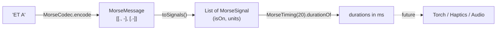

# 3. Timing and signals

Morse is really about **time**, not dots and dashes. A radio, flashlight or vibration motor only
knows "on" and "off" and how long each lasts. `core/timing/` converts a `MorseMessage` into
exactly that. Nothing plays signals yet, but torch, haptics and audio playback will all consume
this output.

## The unit

Everything is measured in **units**. The length of one unit comes from the speed:

```
unit (ms) = 1200 / WPM
```

| Element | On/off | Units |
| --- | --- | --- |
| Dot | on | 1 |
| Dash | on | 3 |
| Gap between elements of one letter | off | 1 |
| Gap between letters | off | 3 |
| Gap between words | off | 7 |

These constants live in `MorseSignal.Companion` (`DOT_UNITS`, `DASH_UNITS`, ...).

### Where does 1200 come from?

Speed is defined with the standard word **"PARIS "** (including the gap after it), which is
exactly **50 units** long. At *W* words per minute you send 50·*W* units per 60 000 ms, so:

```
unit = 60 000 ms / (50 × W) = 1200 / W ms
```

| WPM | Unit | One "PARIS " |
| --- | --- | --- |
| 5 (`MIN_WPM`) | 240 ms | 12 s |
| 20 (`DEFAULT_WPM`) | 60 ms | 3 s |
| 60 (`MAX_WPM`) | 20 ms | 1 s |

`MorseTiming(wordsPerMinute)` rejects speeds outside 5..60 in its `init` block, and exposes
`unit` as a `kotlin.time.Duration`.

> **Concept: `kotlin.time.Duration`.** A multiplatform standard-library type for lengths of
> time. `60.milliseconds`, `unit * 3` and `Duration.ZERO` read naturally and avoid mixing up
> "is this Long seconds or milliseconds?".

## From message to signals



`MorseMessage.toSignals()` walks words, then letters, then elements, and inserts the right gap
**between** items (never before the first or after the last):

```kotlin
words.forEachIndexed { wordIndex, word ->
    if (wordIndex > 0) add(off(WORD_GAP_UNITS))           // 7
    word.letters.forEachIndexed { letterIndex, letter ->
        if (letterIndex > 0) add(off(LETTER_GAP_UNITS))   // 3
        letter.elements.forEachIndexed { elementIndex, element ->
            if (elementIndex > 0) add(off(ELEMENT_GAP_UNITS)) // 1
            add(on(if (element == Dot) DOT_UNITS else DASH_UNITS))
        }
    }
}
```

(Simplified: the real code uses `MorseSignal(isOn = ..., units = ...)` and `when`.)

### Worked example: `"ET A"` at 20 WPM (unit = 60 ms)

| # | Comes from | On? | Units | Duration |
| --- | --- | --- | --- | --- |
| 1 | `E` dot | on | 1 | 60 ms |
| 2 | gap between letters | off | 3 | 180 ms |
| 3 | `T` dash | on | 3 | 180 ms |
| 4 | gap between words | off | 7 | 420 ms |
| 5 | `A` dot | on | 1 | 60 ms |
| 6 | gap inside the letter | off | 1 | 60 ms |
| 7 | `A` dash | on | 3 | 180 ms |
| | **total** | | **19** | **1140 ms** |

Drawn as a timeline (each block is 1 unit, █ = on, ░ = off; the spaces are only there to
make it readable):

```
E   gap  T     word gap       A
█   ░░░  ███   ░░░░░░░       █░███
```

### Check: PARIS

`MorseTimingTest.parisIsFiftyUnitsIncludingTrailingWordGap` confirms the definition: the
signals for `PARIS` add up to 43 units, and the 7-unit trailing word gap (not emitted) makes 50.

| Letter | Code | Units | Following gap |
| --- | --- | --- | --- |
| P | `.--.` | 1+1+3+1+3+1+1 = 11 | 3 |
| A | `.-` | 1+1+3 = 5 | 3 |
| R | `.-.` | 1+1+3+1+1 = 7 | 3 |
| I | `..` | 1+1+1 = 3 | 3 |
| S | `...` | 1+1+1+1+1 = 5 | (7, word gap) |
| | | **31** | **12 (+7)** |

31 + 12 = 43, plus 7 = 50. ✔

## Why this design

| Choice | Reason |
| --- | --- |
| Signals store **units**, not milliseconds | The same sequence works at any speed; `MorseTiming` converts at the end |
| Signals always alternate on/off and start with "on" | A player can simply loop: switch output, wait, repeat |
| Pure function on `MorseMessage` | Trivial to unit test, with no clocks, coroutines or devices involved |
| Output-agnostic | Torch, vibration and audio differ only in *what* they switch, not *when* |

Two outputs consume these signals today. **Audio** converts them to exact audio frames and
renders a tone (see [Audio playback](08-audio-playback.md)). The **flashlight** switches the
torch from a drift-free, time-driven loop (see [Flashlight transmission](09-flashlight.md)).
Still to come: vibration, and Farnsworth timing (letters at full speed, longer gaps between
them, for learners).
