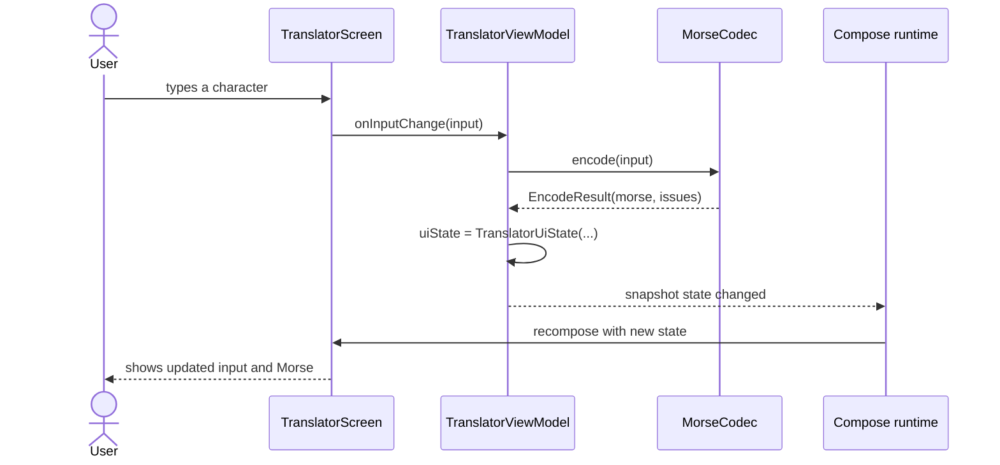
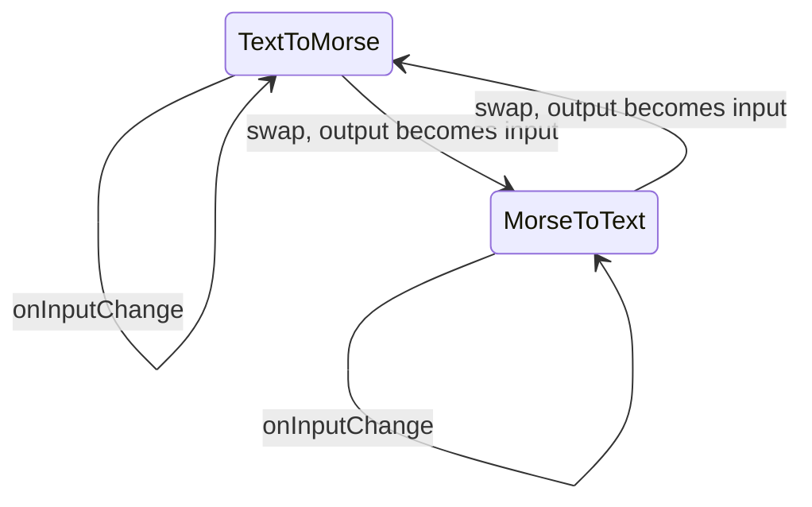
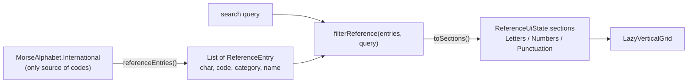
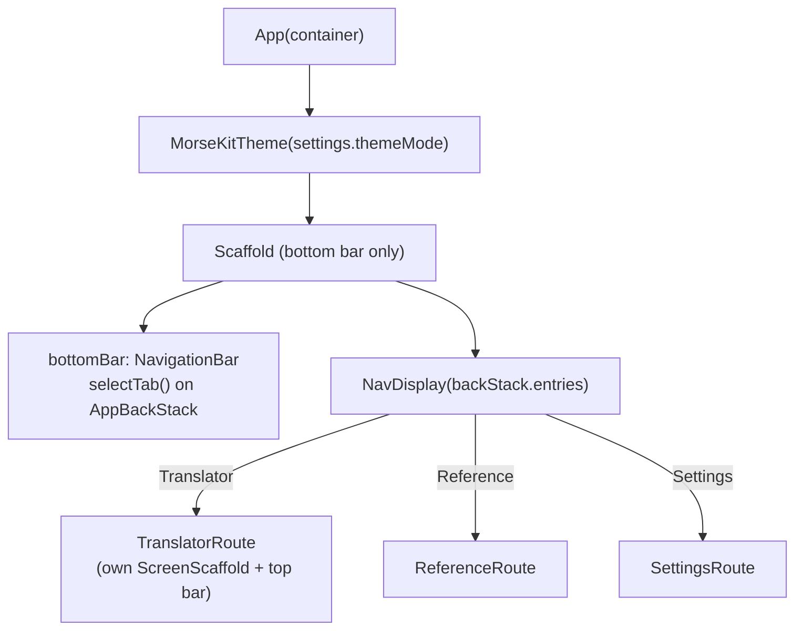
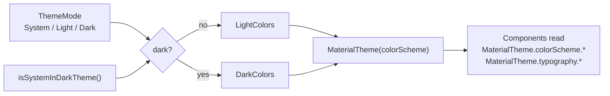
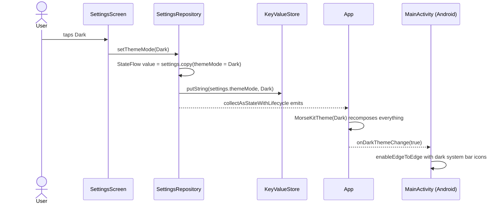
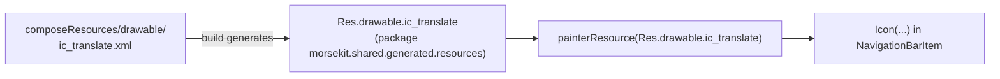

# 4. Compose UI and state

All UI is written **once** in `commonMain` with Compose Multiplatform. On Android it renders
through Jetpack Compose; on iOS the same code draws into a `UIViewController`
(`ComposeUIViewController`).

## Compose in 60 seconds

| Idea | What it means | Where to see it |
| --- | --- | --- |
| `@Composable` function | Describes UI for the current state. It doesn't return a view; it *emits* UI | Every screen and component |
| State | A value Compose watches. Reading it inside a composable subscribes to changes | `TranslatorViewModel.uiState` |
| Recomposition | When state changes, Compose re-runs only the composables that read it | Typing in the translator |
| `remember { }` | Keeps a value across recompositions (lost when the composable leaves the screen) | `remember(morse) { morse.toDisplayGlyphs() }` in `MorseDisplay` |
| `rememberSaveable { }` | Like `remember`, but survives Android configuration changes and process death | Selected tab in `App.kt` |
| `Modifier` | A chain of layout, drawing and behaviour decorations | `Modifier.fillMaxSize().padding(16.dp)` |

## Unidirectional data flow (UDF)

**State flows down, events flow up.** Composables never compute translations; they display
state and report user events.


The same flow as a timeline:



### Why this shape

| Benefit | How |
| --- | --- |
| Testable | `TranslatorViewModelTest` checks behaviour with no UI at all |
| Predictable | One source of truth (`uiState`); the screen is a pure function of it |
| Previewable | `TranslatorScreen` takes plain values and lambdas, so it can be previewed or tested with fake data |

## Route vs Screen (state hoisting)

`feature/translator/TranslatorScreen.kt` contains two composables:

| Composable | Knows about | Job |
| --- | --- | --- |
| `TranslatorRoute` | `TranslatorViewModel`, `PlatformServices` | Gets the ViewModel and connects its methods and services to lambdas |
| `TranslatorScreen` | Only `TranslatorUiState` + lambdas | Draws the UI |

```kotlin
@Composable
fun TranslatorRoute(platformServices: PlatformServices, ..., viewModel: TranslatorViewModel = viewModel { TranslatorViewModel() }) {
    TranslatorScreen(
        state = viewModel.uiState,
        onInputChange = viewModel::onInputChange,
        onCopy = platformServices.clipboard::copyText,
        // ...
    )
}
```

> **Concept: state hoisting.** Moving state *out* of a composable, up to its caller, makes the
> composable stateless and reusable. `MorseTextField` doesn't own its text; it takes a `value`
> and an `onValueChange`.

## The ViewModel

```kotlin
class TranslatorViewModel(private val codec: MorseCodec = MorseCodec()) : ViewModel() {
    var uiState by mutableStateOf(TranslatorUiState())
        private set
    fun onInputChange(input: String) { uiState = translate(uiState.direction, input) }
    ...
}
```

| Question | Answer |
| --- | --- |
| Where does `ViewModel` come from? | `org.jetbrains.androidx.lifecycle:lifecycle-viewmodel-compose`, JetBrains' multiplatform build of AndroidX lifecycle. The same class works on Android and iOS |
| How is it created? | `viewModel { TranslatorViewModel() }`. The lambda is a factory; Compose looks it up in the nearest `ViewModelStoreOwner` and only calls the factory the first time |
| Who owns it? | Android: the `Activity`, so it survives rotation. iOS: the owner provided by `ComposeUIViewController` |
| Why `private set`? | Only the ViewModel may change the state; the UI can only read it |
| Why a constructor default for `codec`? | Production code gets the real codec; tests could pass another one. That's dependency injection without a framework |

### Snapshot state vs `StateFlow`

Many Android samples expose `StateFlow` from ViewModels. Here we deliberately use Compose's
`mutableStateOf`:

| | `mutableStateOf` (used here) | `StateFlow` + `collectAsState` |
| --- | --- | --- |
| Update timing | Synchronous: the next read sees the new value | Delivered to the collector asynchronously |
| TextField safety | Safe: cursor and IME stay in sync | Can cause cursor jumps or lost characters with fast typing |
| Needs coroutines | No | Yes, to collect |
| Readable in tests | Directly: `viewModel.uiState` | Directly: `state.value` |

Google's guidance for text fields is to keep their state synchronous, which is why this
translator uses snapshot state.

### Translator state transitions

`TranslatorUiState(direction, input, output, issues)` is immutable. Every action builds a
**new** state:

| Action | New state |
| --- | --- |
| `onInputChange(x)` | Same direction, `input = x`, output/issues recomputed |
| `swapDirection()` | Reversed direction, `input = old output` (minus `�` placeholders), recomputed |
| `onDirectionSelected(d)` | If `d` is the current direction, nothing happens; otherwise the same as swap |
| `onClear()` | Empty state, but keeps the direction |



### Status: empty, invalid and partial input

`TranslatorUiState.status` is derived from the state, so the screen doesn't have to work it
out itself:

| Status | When | Output card shows | Copy/Share |
| --- | --- | --- | --- |
| `Empty` | Input is blank or only separators (`" / "`) | A hint: "Type text above..." | disabled |
| `Invalid` | Input present, nothing translatable (`###`, `hello` in Morse mode) | "Nothing here could be translated." in the error color | disabled |
| `Partial` | Some output, some issues (`SOS #`) | The translation | enabled |
| `Complete` | Everything translated | The translation | enabled |

Issues are summarized by `issueMessages()` (one line per kind, at most 5 examples each) and
shown under the input field, which switches to its error style:

| Issues | Message |
| --- | --- |
| `#`, `😀` unsupported | No Morse code for “#”, “😀” (skipped) |
| `........` unknown | Unknown Morse code: “........” |
| `-x-` malformed | Use only dots and dashes: “-x-” |
| invisible `U+FE0F` | No Morse code for “U+FE0F” (skipped) |

### Copy feedback

After **Copy**, a snackbar says "Copied to clipboard", except on Android 13+, where the OS
already shows its own clipboard confirmation. `ClipboardService.showsSystemConfirmation`
reports this, so the shared UI doesn't need to know the Android version.

## The Reference screen

A second feature built the same way: `ReferenceRoute` → `ReferenceScreen`, with a
`ReferenceViewModel` holding snapshot state.



| Concept | Where |
| --- | --- |
| **No duplicated mappings.** Entries are built from `MorseAlphabet.mappings`; the feature adds only punctuation *names*. A test fails if a punctuation mark has no name, or a name has no mark | `ReferenceEntry.kt` |
| **Search as a pure function.** It matches a single character (`a`), a code prefix (`.-`, `·−`) or part of a name (`comma`), and keeps alphabet order | `ReferenceSearch.kt` |
| **`LazyVerticalGrid` with `GridCells.Adaptive(96.dp)`.** As many columns as fit, so it adapts to phones, tablets and rotation. Only visible cells are composed | `ReferenceScreen.kt` |
| **Full-width headers.** `item(span = { GridItemSpan(maxLineSpan) })` makes a section title span every column | `ReferenceGrid` |
| **Stable `key`s.** Each cell is keyed by its character, so filtering reuses cells instead of recreating them | `items(..., key = ...)` |
| **Accessibility.** `clearAndSetSemantics { contentDescription = "A, dot dash" }` makes each card read as one sentence, not "A" then "•−" | `ReferenceCell` |

## App shell and navigation



Tabs are an `enum class TopLevelDestination`. Navigation 3's `NavDisplay` renders
`AppBackStack.entries`, and system back follows `AppBackStack.goBack()`: another tab goes to the
Translator, and the Translator leaves the app. Each screen draws its own top bar
(`ScreenScaffold`). See [Navigation](12-navigation.md) for the back rules and how tab state is
kept.

> **Concept: `Scaffold` and `innerPadding`.** `Scaffold` lays out the top bar, bottom bar and
> content, and hands the content an `innerPadding` so it isn't hidden behind the bars. We pass
> it on as `Modifier.padding(innerPadding)`.

## Theming



| File | Contents |
| --- | --- |
| `ui/theme/Color.kt` | `LightColors` / `DarkColors`: Material 3 color schemes (teal primary, amber tertiary) |
| `ui/theme/Theme.kt` | `ThemeMode.isDark()` and `MorseKitTheme(themeMode, content)` (`ThemeMode` itself lives in `core/settings`) |
| `ui/theme/Type.kt` | `TextStyle.toMorseStyle()`: monospace + letter spacing for Morse |

> **Concept: color *roles*.** Material 3 components don't use hard-coded colors; they use roles
> like `primary`, `onPrimary`, `surfaceContainer`, `error`. Swapping the scheme restyles
> everything. We set the `surfaceContainer*` roles explicitly, because their defaults are
> Material's purple-tinted neutrals, which would clash with a teal theme.

### Where the theme comes from

The user picks a theme in Settings. It's saved, and the whole app switches immediately:



> **Why the callback to `MainActivity`?** Status and navigation bar icons are drawn by Android,
> not Compose. `enableEdgeToEdge()` picks icon colors from the *system* dark mode, so choosing
> Dark while the phone is in light mode would leave dark icons on a dark bar. `App` reports the
> resolved theme through `onDarkThemeChange`, and `MainActivity` restyles the bars.
> (iOS doesn't do this yet; see the note in the Settings section.)

## The Settings screen

`SettingsRoute` collects `SettingsRepository.settings` and passes plain values and lambdas to a
stateless `SettingsScreen`, the same Route/Screen split as the other features.

| Section | Control | Saved as | Range |
| --- | --- | --- | --- |
| Appearance | Theme: segmented System / Light / Dark | `settings.themeMode` (enum name) | 3 options |
| Playback | Speed slider, with "a dot lasts N ms" from `MorseTiming` | `settings.wordsPerMinute` | 5–60 WPM |
| Playback | Tone slider, snapping to 50 Hz steps | `settings.toneFrequencyHz` | 400–1000 Hz |
| About | Version (`AppInfo`), privacy notice, open-source libraries | not saved | |
| (below the cards) | Developer credits: flat text in Space Grotesk, with links to GitHub and geekofia.in | not saved | |

Speed and tone are stored now and will be read by audio, flashlight and vibration playback.

> **Links and a bundled variable font.** The credits line is an `AnnotatedString` built with
> `withLink(LinkAnnotation.Url(url, TextLinkStyles(...)))`. `Text` makes each link tappable
> (opening the browser through the platform's URI handler) and exposes it to screen readers,
> with no click handling code. The font, **Space Grotesk**, is one variable TTF in
> `composeResources/font/`, so it works on Android and iOS. Its weight axis runs from 300 to 700
> with a default of **300**, so `spaceGroteskFontFamily()` declares
> `Font(Res.font.space_grotesk, FontWeight.Normal / Medium / SemiBold)`. Compose Multiplatform's
> `Font()` turns each weight into variation settings (`wght` = 400 / 500 / 600); without them,
> text would render at the file's Light default. The font is licensed under the SIL Open Font
> License 1.1: it's credited in About, and the licence text is in `licenses/SpaceGrotesk-OFL.txt`
> (it's also embedded in the font file's name table).

> **No ViewModel here, on purpose.** `SettingsRepository` already holds the state (`StateFlow`),
> validates it (clamps out-of-range values) and persists it. A `SettingsViewModel` would only
> forward calls, so the screen talks to the repository directly. Add a ViewModel when there's
> screen-specific state or logic to hold.

> **`StateFlow` here, snapshot state in the translator.** Settings are changed by taps and
> sliders, not typed into a text field, so an asynchronous `StateFlow` is fine.
> `collectAsStateWithLifecycle()` converts it to Compose state and stops collecting while the
> app is in the background.

> **iOS status bar.** On iOS the status bar still follows the *system* appearance. Matching it
> to the in-app theme needs a hook in `ComposeUIViewController` and isn't done yet.

## Reusable components (`ui/components`)

| Component | Wraps | Adds |
| --- | --- | --- |
| `PrimaryButton` / `SecondaryButton` | `Button` / `OutlinedButton` | A consistent text-label API |
| `SectionCard` | `Card` + `Column` | Optional title, standard padding and spacing |
| `MorseTextField` | `OutlinedTextField` | `isMorse` mode: monospace, auto-correct off, ASCII keyboard |
| `MorseDisplay` | `Text` in a `SelectionContainer` | Renders `.`/`-` as `•`/`−`, with an empty-state placeholder |
| `PlaceholderContent` | `Column` of two `Text`s | Centered title + message for unbuilt screens |

> **Display vs data.** `MorseDisplay` shows `•` and `−` because they're easier to read, but
> **Copy** and **Share** use the canonical `state.output` (`.` and `-`). Presentation never
> changes the underlying data.

## Compose Multiplatform resources

Files in `shared/src/commonMain/composeResources/` are turned into a generated, type-safe `Res`
object at build time:



The icons are Android-style vector XML, and CMP renders the same file on iOS. This avoids adding
an icon library dependency. Strings can later move into `composeResources/values/strings.xml`
the same way (`Res.string.*`).

## Opt-in APIs

Some Compose APIs are marked experimental, so you have to opt in to use them:

```kotlin
@OptIn(ExperimentalMaterial3Api::class)   // CenterAlignedTopAppBar, SegmentedButton
@OptIn(ExperimentalLayoutApi::class)      // FlowRow
```

The annotation is a conscious acknowledgement that the API may change in a future release.
