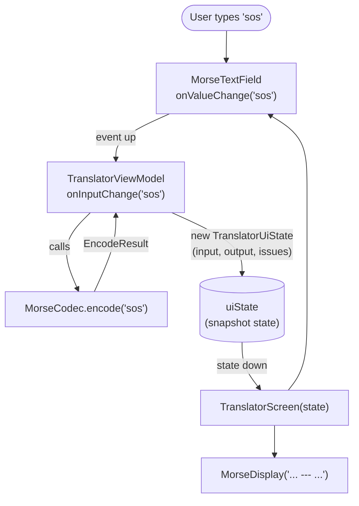
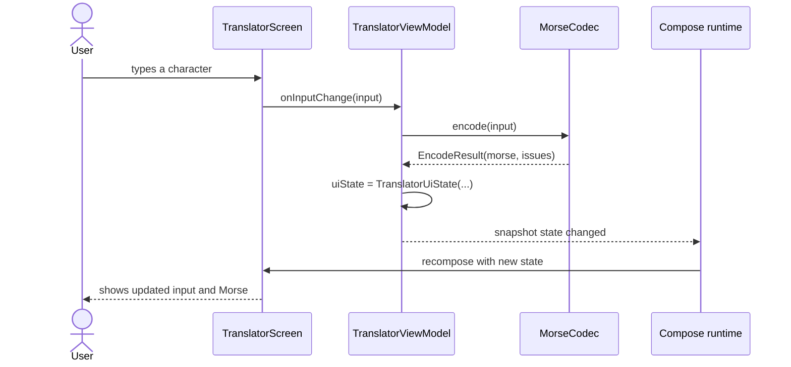
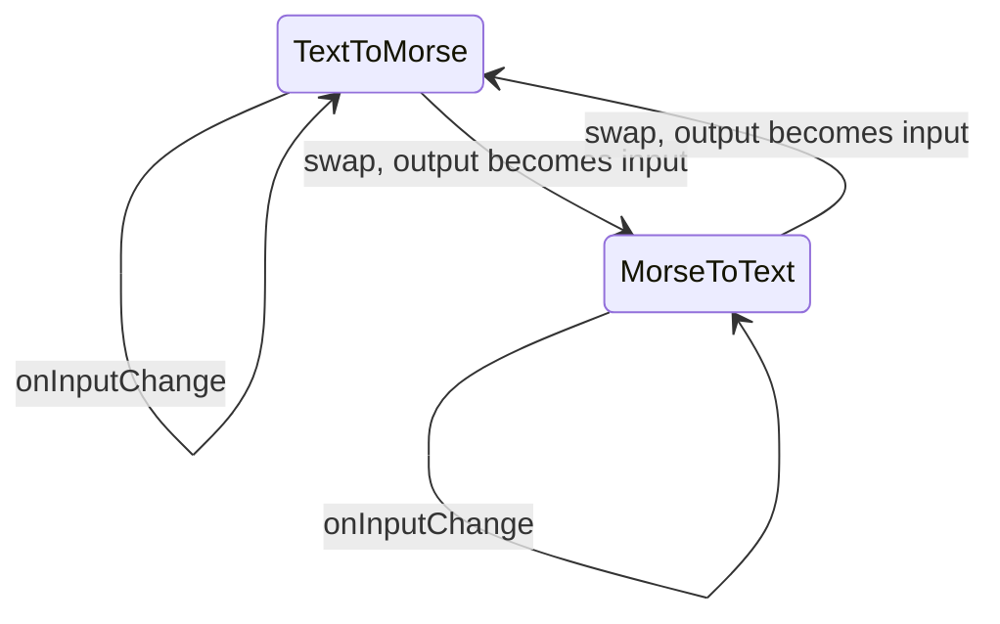
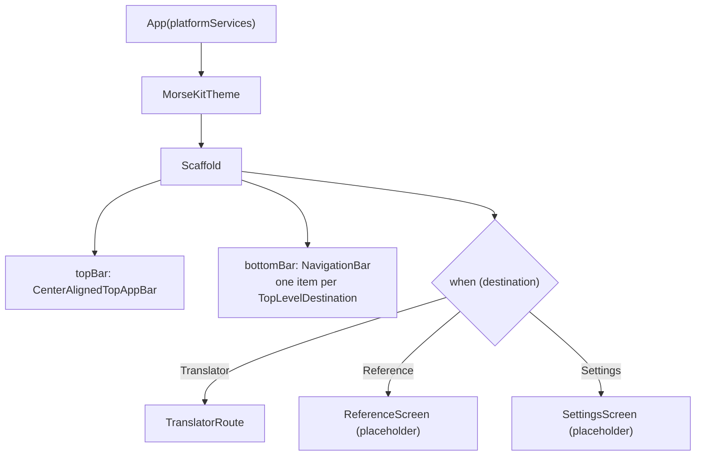
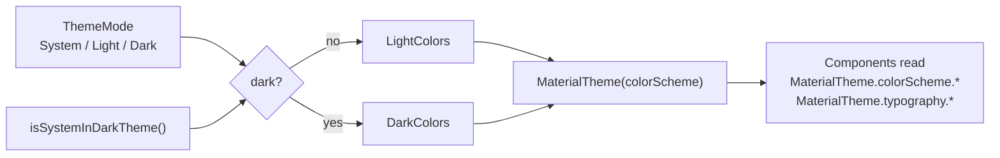
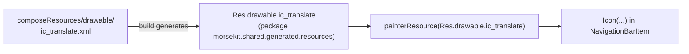

# 4. Compose UI and state

All UI is written **once** in `commonMain` with Compose Multiplatform. On Android it renders
through Jetpack Compose; on iOS the same code draws into a `UIViewController`
(`ComposeUIViewController`).

## Compose in 60 seconds

| Idea | What it means | Where to see it |
| --- | --- | --- |
| `@Composable` function | Describes UI for the current state. It doesn't return a view; it *emits* UI | Every screen and component |
| State | A value Compose watches. Reading it inside a composable subscribes to changes | `TranslatorViewModel.uiState` |
| Recomposition | When state changes, Compose re-runs only the composables that read it | Typing in the translator |
| `remember { }` | Keeps a value across recompositions (lost when the composable leaves the screen) | `remember(morse) { morse.toDisplayGlyphs() }` in `MorseDisplay` |
| `rememberSaveable { }` | Like `remember`, but survives Android configuration changes and process death | Selected tab in `App.kt` |
| `Modifier` | A chain of layout, drawing and behaviour decorations | `Modifier.fillMaxSize().padding(16.dp)` |

## Unidirectional data flow (UDF)

**State flows down, events flow up.** Composables never compute translations; they display
state and report user events.



The same flow as a timeline:



### Why this shape

| Benefit | How |
| --- | --- |
| Testable | `TranslatorViewModelTest` checks behaviour with no UI at all |
| Predictable | One source of truth (`uiState`); the screen is a pure function of it |
| Previewable | `TranslatorScreen` takes plain values and lambdas, so it can be previewed or tested with fake data |

## Route vs Screen (state hoisting)

`feature/translator/TranslatorScreen.kt` contains two composables:

| Composable | Knows about | Job |
| --- | --- | --- |
| `TranslatorRoute` | `TranslatorViewModel`, `PlatformServices` | Gets the ViewModel and connects its methods and services to lambdas |
| `TranslatorScreen` | Only `TranslatorUiState` + lambdas | Draws the UI |

```kotlin
@Composable
fun TranslatorRoute(platformServices: PlatformServices, ..., viewModel: TranslatorViewModel = viewModel { TranslatorViewModel() }) {
    TranslatorScreen(
        state = viewModel.uiState,
        onInputChange = viewModel::onInputChange,
        onCopy = platformServices.clipboard::copyText,
        // ...
    )
}
```

> **Concept: state hoisting.** Moving state *out* of a composable, up to its caller, makes the
> composable stateless and reusable. `MorseTextField` doesn't own its text; it takes a `value`
> and an `onValueChange`.

## The ViewModel

```kotlin
class TranslatorViewModel(private val codec: MorseCodec = MorseCodec()) : ViewModel() {
    var uiState by mutableStateOf(TranslatorUiState())
        private set
    fun onInputChange(input: String) { uiState = translate(uiState.direction, input) }
    ...
}
```

| Question | Answer |
| --- | --- |
| Where does `ViewModel` come from? | `org.jetbrains.androidx.lifecycle:lifecycle-viewmodel-compose`, JetBrains' multiplatform build of AndroidX lifecycle. The same class works on Android and iOS |
| How is it created? | `viewModel { TranslatorViewModel() }`. The lambda is a factory; Compose looks it up in the nearest `ViewModelStoreOwner` and only calls the factory the first time |
| Who owns it? | Android: the `Activity`, so it survives rotation. iOS: the owner provided by `ComposeUIViewController` |
| Why `private set`? | Only the ViewModel may change the state; the UI can only read it |
| Why a constructor default for `codec`? | Production code gets the real codec; tests could pass another one. That's dependency injection without a framework |

### Snapshot state vs `StateFlow`

Many Android samples expose `StateFlow` from ViewModels. Here we deliberately use Compose's
`mutableStateOf`:

| | `mutableStateOf` (used here) | `StateFlow` + `collectAsState` |
| --- | --- | --- |
| Update timing | Synchronous: the next read sees the new value | Delivered to the collector asynchronously |
| TextField safety | Safe: cursor and IME stay in sync | Can cause cursor jumps or lost characters with fast typing |
| Needs coroutines | No | Yes, to collect |
| Readable in tests | Directly: `viewModel.uiState` | Directly: `state.value` |

Google's guidance for text fields is to keep their state synchronous, which is why this
translator uses snapshot state.

### Translator state transitions

`TranslatorUiState(direction, input, output, issues)` is immutable. Every action builds a
**new** state:

| Action | New state |
| --- | --- |
| `onInputChange(x)` | Same direction, `input = x`, output/issues recomputed |
| `swapDirection()` | Reversed direction, `input = old output`, recomputed |
| `onDirectionSelected(d)` | If `d` is the current direction, nothing happens; otherwise the same as swap |
| `onClear()` | Empty state, but keeps the direction |



## App shell and navigation



Navigation is intentionally simple: an `enum class TopLevelDestination` and a
`rememberSaveable` variable holding the selected tab. Adding a tab means adding an enum entry
plus a `when` branch. The compiler forces the branch, because `when` over an enum is
exhaustive. A navigation library becomes worthwhile once we need a back stack (detail screens).

> **Concept: `Scaffold` and `innerPadding`.** `Scaffold` lays out the top bar, bottom bar and
> content, and hands the content an `innerPadding` so it isn't hidden behind the bars. We pass
> it on as `Modifier.padding(innerPadding)`.

## Theming



| File | Contents |
| --- | --- |
| `ui/theme/Color.kt` | `LightColors` / `DarkColors`: Material 3 color schemes (teal primary, amber tertiary) |
| `ui/theme/Theme.kt` | `ThemeMode` enum and `MorseKitTheme(themeMode, content)` |
| `ui/theme/Type.kt` | `TextStyle.toMorseStyle()`: monospace + letter spacing for Morse |

> **Concept: color *roles*.** Material 3 components don't use hard-coded colors; they use roles
> like `primary`, `onPrimary`, `surfaceContainer`, `error`. Swapping the scheme restyles
> everything. We set the `surfaceContainer*` roles explicitly, because their defaults are
> Material's purple-tinted neutrals, which would clash with a teal theme.

`ThemeMode` currently always defaults to `System`. A Settings screen with saved preferences will
drive it later.

## Reusable components (`ui/components`)

| Component | Wraps | Adds |
| --- | --- | --- |
| `PrimaryButton` / `SecondaryButton` | `Button` / `OutlinedButton` | A consistent text-label API |
| `SectionCard` | `Card` + `Column` | Optional title, standard padding and spacing |
| `MorseTextField` | `OutlinedTextField` | `isMorse` mode: monospace, auto-correct off, ASCII keyboard |
| `MorseDisplay` | `Text` in a `SelectionContainer` | Renders `.`/`-` as `•`/`−`, with an empty-state placeholder |
| `PlaceholderContent` | `Column` of two `Text`s | Centered title + message for unbuilt screens |

> **Display vs data.** `MorseDisplay` shows `•` and `−` because they're easier to read, but
> **Copy** and **Share** use the canonical `state.output` (`.` and `-`). Presentation never
> changes the underlying data.

## Compose Multiplatform resources

Files in `shared/src/commonMain/composeResources/` are turned into a generated, type-safe `Res`
object at build time:



The icons are Android-style vector XML, and CMP renders the same file on iOS. This avoids adding
an icon library dependency. Strings can later move into `composeResources/values/strings.xml`
the same way (`Res.string.*`).

## Opt-in APIs

Some Compose APIs are marked experimental, so you have to opt in to use them:

```kotlin
@OptIn(ExperimentalMaterial3Api::class)   // CenterAlignedTopAppBar, SegmentedButton
@OptIn(ExperimentalLayoutApi::class)      // FlowRow
```

The annotation is a conscious acknowledgement that the API may change in a future release.
