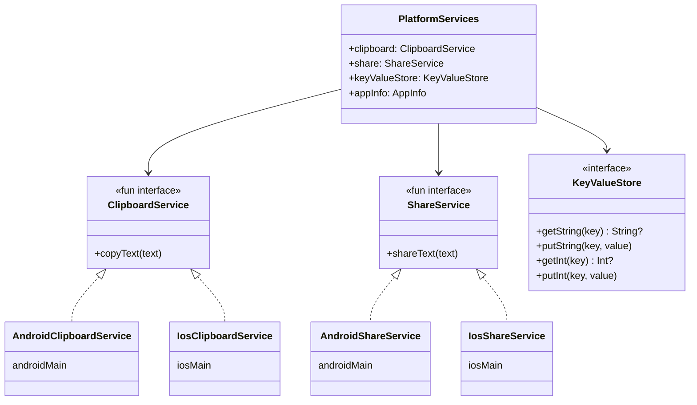
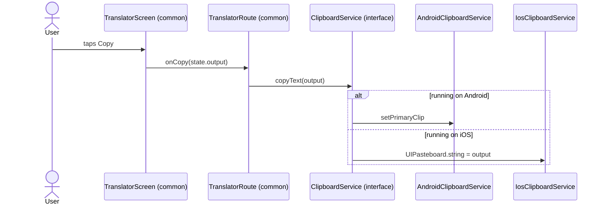
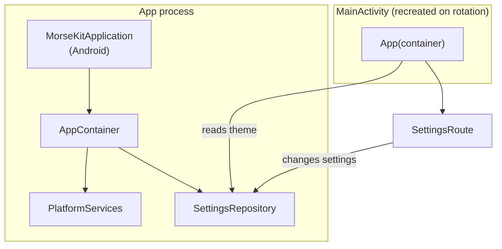

# 5. Platform services

Shared code sometimes needs things only the operating system can do: copy to the clipboard,
open the share sheet, and later turn on the torch, vibrate, or play a tone. The rule in
MorseKit is:

> **`commonMain` depends on interfaces. `androidMain` and `iosMain` provide the
> implementations. The app entry points connect them.**

## The pieces



| Interface (`commonMain`) | Android (`androidMain`) | iOS (`iosMain`) |
| --- | --- | --- |
| `ClipboardService.copyText` | `ClipboardManager.setPrimaryClip(ClipData.newPlainText(...))` | `UIPasteboard.generalPasteboard.string = text` |
| `ShareService.shareText` | `Intent.ACTION_SEND` in `Intent.createChooser(...)` | `UIActivityViewController` presented from the top-most view controller |
| `KeyValueStore` | `SharedPreferences` (file `morsekit`) | `NSUserDefaults.standardUserDefaults` |
| `AppInfo` (data, not a service) | `PackageManager.getPackageInfo` → `versionName`, `longVersionCode` | `NSBundle.mainBundle` → `CFBundleShortVersionString`, `CFBundleVersion` |

`InMemoryKeyValueStore` (in `commonMain`) is a third implementation, used by tests and previews.

> **Why not DataStore or `multiplatform-settings`?** Both are good libraries, but three
> preferences don't need them. The interface is four methods, each platform implementation is
> about 15 lines, and no dependency is added. If storage needs grow (history, favorites), a real
> database would replace this rather than a bigger key-value library.

Factory functions build the bundle for each platform:

- `androidPlatformServices(context)`: `shared/src/androidMain/.../platform/AndroidPlatformServices.kt`
- `iosPlatformServices(presenter)`: `shared/src/iosMain/.../platform/IosPlatformServices.kt`

## How a "Copy" tap reaches the OS



The common code **never knows** which one runs. The platform was chosen once, at startup:

| Platform | Created in | Creates |
| --- | --- | --- |
| Android | `MorseKitApplication.container` (lazy, once per process) | `AppContainer(androidPlatformServices(this))` |
| iOS | `MainViewController()` (once per launch) | `AppContainer(iosPlatformServices(presenter = { controller }))` |

The container is passed into `App(container)` and handed down as parameters. There's no DI
framework, no global singleton, and no service locator.

## The app container

```kotlin
class AppContainer(val platformServices: PlatformServices) {
    val settingsRepository = SettingsRepository(platformServices.keyValueStore)
}
```

`AppContainer` holds objects that must be **shared by several screens** and **outlive a single
screen**. Settings are the first: `App` reads the theme, and the Settings screen changes it, so
both must observe the same `SettingsRepository`.



> **Why not create it in `MainActivity`?** Android recreates the Activity on rotation. A
> repository created there would be replaced each time, while anything retained across rotation
> (like a ViewModel) would still hold the old one. `Application` lives as long as the process, so
> that's where app-scoped objects belong. iOS has no such recreation, so `MainViewController()`
> is enough.

## Interfaces vs `expect`/`actual`

KMP offers two ways to reach platform code. The template originally used `expect`/`actual`
(`expect fun getPlatform(): Platform`); we switched to interfaces for services.

| | `expect`/`actual` | Interface + implementations (used here) |
| --- | --- | --- |
| How | `expect fun foo()` in common, `actual fun foo()` in each platform source set | `interface Foo` in common, `class AndroidFoo : Foo` etc. |
| Construction parameters | Hard: every `actual` must match the same signature | Easy: Android takes a `Context`, iOS takes a view-controller provider |
| Fakes in tests | Not possible: there's exactly one `actual` per platform | Trivial: `InMemoryKeyValueStore()`, `clipboard = {}` |
| Best for | Small, parameterless platform facts or functions (e.g. current time, UUID, platform name) | Services with state, dependencies or side effects |

> **Concept: `fun interface`.** An interface with a single abstract method can be implemented with
> a lambda: `ClipboardService { text -> ... }`, or `{}` for a no-op. The Android `@Preview` in
> `MainActivity.kt` uses exactly that: `PlatformServices(clipboard = {}, share = {}, ...)`.

## Android details

```kotlin
fun androidPlatformServices(context: Context): PlatformServices {
    val appContext = context.applicationContext
    ...
}
```

| Detail | Why |
| --- | --- |
| Uses `applicationContext`, not the `Activity` | ViewModels outlive Activities (e.g. on rotation). Holding an `Activity` reference would leak it |
| `FLAG_ACTIVITY_NEW_TASK` on the share chooser | Required when starting an activity from a non-Activity context |
| No permissions needed | Clipboard and share intents don't need manifest permissions (vibration will need `VIBRATE`) |

## iOS details: Kotlin/Native interop

```kotlin
@OptIn(ExperimentalForeignApi::class)
override fun shareText(text: String) {
    val host = presenter()?.topmostPresented() ?: return
    val activity = UIActivityViewController(activityItems = listOf(text), applicationActivities = null)
    activity.popoverPresentationController?.let { popover ->
        popover.sourceView = host.view
        popover.sourceRect = host.view.bounds.useContents {
            CGRectMake(size.width / 2, size.height / 2, 0.0, 0.0)
        }
    }
    host.presentViewController(activity, animated = true, completion = null)
}
```

| Concept | Explanation |
| --- | --- |
| `platform.UIKit.*` imports | Kotlin/Native ships bindings for Apple frameworks, so UIKit classes are ordinary Kotlin classes |
| Obj-C categories become extensions | `popoverPresentationController` is declared in an Obj-C *category*, so in Kotlin it's an extension property you import |
| `CValue<CGRect>` and `useContents { }` | C structs (like `CGRect`) are passed by value as `CValue`. `useContents` gives temporary access to the fields |
| `@OptIn(ExperimentalForeignApi::class)` | C-interop APIs require opting in |
| Popover anchor | On iPad the share sheet is a popover and **crashes** without `sourceView`/`sourceRect` |
| `presenter: () -> UIViewController?` | The service needs the Compose view controller, which is created *after* the services, so we pass a lambda that reads it lazily |

The lazy presenter in `MainViewController.kt`:

```kotlin
fun MainViewController(): UIViewController {
    lateinit var controller: UIViewController
    val container = AppContainer(iosPlatformServices(presenter = { controller }))
    controller = ComposeUIViewController { App(container) }
    return controller
}
```

The lambda reads `controller` only when the user taps Share, by which time it's been assigned.

## Audio

`PcmAudioPlayer` is the audio abstraction: it only plays rendered samples, and all Morse timing
lives in shared code. It's covered in [Audio playback](08-audio-playback.md).

## Planned services (not built yet)

These will follow the same pattern when their features are implemented:

| Interface | Android | iOS | Consumes |
| --- | --- | --- | --- |
| `TorchController` | `CameraManager.setTorchMode` | `AVCaptureDevice.torchMode` | `List<MorseSignal>` |
| `HapticController` | `Vibrator` / `VibrationEffect` (+ `VIBRATE` permission) | Core Haptics (`CHHapticEngine`) | `List<MorseSignal>` |
