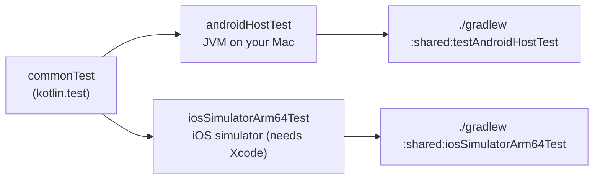
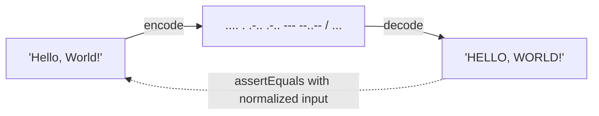

# 6. Testing

## Where tests run

Tests in `commonTest` are compiled and run **once per platform**. The same test code checks the
JVM (Android) and Kotlin/Native (iOS), which catches cross-platform differences such as the
regex one described in [the engine notes](02-morse-engine.md#tokenizing-finding-words-and-letters).



| Source set | Runs on | Command | Use for |
| --- | --- | --- | --- |
| `commonTest` | every target below | (via the tasks below) | All pure logic: engine, timing, ViewModels |
| `androidHostTest` | Local JVM (fast, no emulator) | `./gradlew :shared:testAndroidHostTest` | Android-only logic that doesn't need a device |
| Android device tests | Emulator or device | `./gradlew :shared:connectedAndroidDeviceTest` | Code that needs real Android APIs (configured via `withDeviceTestBuilder`) |
| `iosTest` | iOS simulator | `./gradlew :shared:iosSimulatorArm64Test` | iOS-only logic |

Almost all tests are in `commonTest`. The exceptions are in `androidHostTest`: `TorchTransmitterTest`, `VibrationTransmitterTest` and `TransmissionRunnerTest` test *shared* suspend code, and `runBlocking` is only available on the JVM (see [Flashlight](09-flashlight.md#testing-a-suspend-function-without-a-coroutine-test-library)).

> **Concept: `kotlin.test`.** A multiplatform assertion library (`@Test`, `assertEquals`,
> `assertFailsWith`, ...). On the JVM it runs on JUnit; on Kotlin/Native it uses a built-in
> runner. You write the test once.

## Test map

The test packages mirror the main packages:

| Test class | Tests | What it covers |
| --- | --- | --- |
| `MorseAlphabetTest` | 10 | All letters/digits/punctuation present, upper case only, unique codes, reversible lookups, categories, rejects duplicates, `MorseLetter` validation |
| `MorseEncodeTest` | 22 | SOS, A–Z, a–z, digits, punctuation, sentences, word separation, whitespace collapsing (tab/newline/NBSP), empty input, unsupported characters, `ı`, emoji as one character, lone surrogates, smart quotes, `encodeChar` |
| `MorseDecodeTest` | 20 | SOS, every code, word separators (`/`, `\|`, newline, 2+ spaces), trimming, empty words, typographic dots/dashes, unknown vs malformed codes, `decodeSymbol`, `parse()` for playback |
| `MorseRoundTripTest` | 6 | text → Morse → text for every character and several sentences; Morse → text → canonical Morse |
| `MorseNormalizerTest` | 7 | Character folding and canonical `normalizeText` / `normalizeMorse` |
| `MorseTokenizerTest` | 6 | Word/letter splitting rules in isolation |
| `MorseProsignsTest` | 3 | Prosign codes vs an independent table, the four that share a code with punctuation, meanings and unique letters |
| `MorseNotationTest` | 5 | Display glyphs; the spoken form for screen readers (pauses between letters, "space" between words) |
| `TapDecoderTest` | 18 | Keying by hand with fake time: dot/dash threshold, letter and word gaps, deadlines, manual edits cancelling pending breaks, backspace, clear |
| `TapViewModelTest` | 6 | Saved tap speed, keying with a fake clock, `heldAsDash`, screen-reader actions |
| `MorseTimingTest` | 8 | Unit length vs WPM, bounds, gap rules, PARIS = 50 units, durations |
| `TranslatorViewModelTest` | 12 | Live conversion, issues, swap (including dropping `�` placeholders), direction selection, clear |
| `StepWpmTest` | 6 | Speed ladder covers 5–60, neighbouring steps, snapping between steps, ends, clamping, 20→60 in a few taps |
| `TranslatorUiStateTest` | 9 | Empty / Invalid / Partial / Complete status, `hasOutput`, grouped and truncated issue messages, invisible characters |
| `ReferenceEntryTest` | 10 | Chart built from the alphabet in order, codes vs the independent table, A–Z/0–9/punctuation coverage, every punctuation mark has a name, prosign entries, accessibility labels (prosign letters spelled out) |
| `ReferenceSearchTest` | 15 | Character, code-prefix (incl. `·−`) and name search, ambiguous `.`/`-`, ordering, no matches; prosigns by letters, meaning and code (HH is eight dots) |
| `ReferenceViewModelTest` | 6 | Initial sections (including Prosigns), filtering hides empty sections, clearing restores all 64 |
| `SettingsRepositoryTest` | 13 | Defaults, immediate updates, persistence across instances, independent keys, clamping, corrupt stored values, the one-time flash warning, reset to defaults (keeps the acknowledgement), `AppSettings` invariants, the tap speed |
| `ToneScheduleTest` | 7 | Units → frames at 16 kHz, gaps, speed scaling, no rounding drift at 13 WPM |
| `MorseAudioRendererTest` | 10 | Length and duration, exact silence, amplitude, fade in/out, measured pitch, speed, limits |
| `MorseAudioPlayerTest` | 8 | Play/stop, completion, replay, restart while playing, stop while idle, stale completions (fake output) |
| `TorchPlanTest` | 11 | On/off at any moment, boundaries, gaps, speed scaling, walking the steps reproduces the signals, limits |
| `TorchTransmitterTest` (androidHostTest) | 6 | Exact switch times with fake time, late wake-ups don't accumulate, huge stalls, cancellation and failure leave the torch off |
| `VibrationPatternTest` | 9 | Segments, gaps, alternation, speed scaling, no millisecond drift at 13 WPM, duration, limits |
| `VibrationTransmitterTest` (androidHostTest) | 4 | Play and wait without clipping the end, cancellation stops it, failure still cancels, empty pattern |
| `TransmissionRunnerTest` (androidHostTest) | 5 | Running state, stop runs cleanup, a new run waits for the previous cleanup, stale finishes ignored |
| `AppBackStackTest` | 8 | Start tab, other tabs above it, back to start then exit, no history between other tabs, in-app back iff more than one entry, save/restore |
| `ShareMessageTest` | 7 | Exact puzzle and reveal texts, canonical Morse in the reveal, both Morse lines decode back, nothing to share, the install call to action, store link |
| `AboutContentTest` | 2 | Credit links, the bundled font credited with its licence |
| `ExitConfirmationTest` | 5 | First back hints, second within the window exits (including exactly at 2 s), after the window it starts over, asks again after exiting |
| `ReviewPrompterTest` | 7 | Due after days and uses, needs a first use, day and use thresholds, 120-day cooldown, first use recorded once, survives restarts |
| `ChooseUpdateModeTest` | 7 | Flexible by default, immediate for priority ≥ 4 or 30 days stale, fallbacks when a type isn't allowed |
| `UpdatePrompterTest` | 4 | Daily check limit, 7-day snooze, newer versions not snoozed, urgent and manual ignore the snooze |
| `UpdateControllerTest` | 10 | Offer on resume, once a day, declines snoozed, interrupted immediate resumed, ready-to-install and Later, manual up-to-date and offered, unsupported platform |
| **Total** | **292** | |

## Testing techniques used

### 1. An independent oracle

`ExpectedMorse.kt` is a **separate copy** of the Morse table used only by tests. If the tests
read their expected values from `MorseAlphabet.International`, a typo in the alphabet would
simply be copied into the expectation and the test would still pass. A second, independent
source catches it.

### 2. Table-driven tests

One test loops over many cases, with a message that names the failing input:

```kotlin
ExpectedMorse.letters.forEach { (char, code) ->
    assertEquals(code, encode(char.toString()), "'$char'")
}
```

### 3. Round-trip (property-style) tests

For any supported text, `decode(encode(text))` must equal the normalized text. This checks
encode and decode *against each other*, over the whole alphabet at once.



### 4. Testing ViewModels without UI

`TranslatorViewModel` has no Android or iOS dependencies and uses snapshot state, so a test can
simply construct it, call methods, and read `uiState`. No Compose test rule, emulator or
coroutine test dispatcher is needed:

```kotlin
@Test
fun swapMovesOutputIntoInput() {
    viewModel.onInputChange("SOS")
    viewModel.swapDirection()
    assertEquals("... --- ...", viewModel.uiState.input)
}
```

### 5. Testing invariants

`assertFailsWith<IllegalArgumentException> { MorseLetter(".x-") }` proves that invalid models
can't be constructed, which is what lets the rest of the code trust them.

## Adding a test

1. Put it in `commonTest`, under the same package as the code being tested.
2. Name the function after the behaviour (`reportsUnknownCodes`, not `test3`).
3. Run `./gradlew :shared:testAndroidHostTest` for fast feedback; run the iOS task before
   committing platform-sensitive changes (string handling, numbers, dates).
