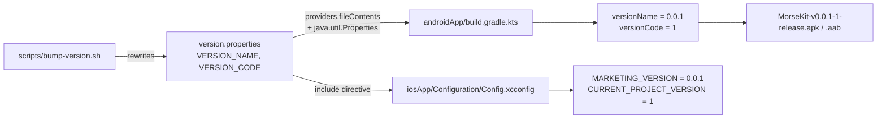
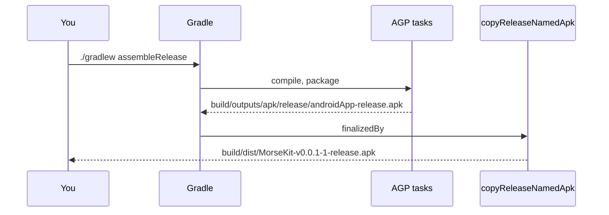

# 7. Versioning and builds

## One version, two platforms

MorseKit uses [Semantic Versioning](https://semver.org): `MAJOR.MINOR.PATCH`, starting at
`0.0.1`. Both apps read the version from **one file** at the repo root:

```properties
// version.properties
VERSION_NAME=0.0.1
VERSION_CODE=1
```



| Field | Meaning | Android | iOS |
| --- | --- | --- | --- |
| `VERSION_NAME` | The version users see, SemVer | `versionName` | `MARKETING_VERSION` → `CFBundleShortVersionString` |
| `VERSION_CODE` | A build number that only ever goes up | `versionCode` | `CURRENT_PROJECT_VERSION` → `CFBundleVersion` |

> **Why one file works for both.** `.properties` files and Xcode `.xcconfig` files share the same
> `KEY=value` syntax, so Xcode can `#include` the file directly. That's also why comments in it
> use `//`: xcconfig understands `//`, and Java `Properties` just reads `//` lines as an unused
> key. A `#` comment would break the Xcode include.

> **Why a separate build number?** Stores reject an upload whose build number has been used
> before, even for the same version. iOS TestFlight often needs several uploads of `0.1.0`, and
> `VERSION_CODE` lets you do that (`bump-version.sh build`). Android's `versionCode` must also
> increase with every Play upload.

### Rules the build enforces

`androidApp/build.gradle.kts` fails fast if the file is wrong:

| Check | Example that fails |
| --- | --- |
| `VERSION_NAME` is exactly `MAJOR.MINOR.PATCH`, with no leading zeros | `1.0`, `01.2.3`, `1.0.0-beta` |
| `VERSION_CODE` is a positive integer | `0`, `abc` |

Pre-release tags like `-beta.1` aren't allowed, because iOS requires `CFBundleShortVersionString`
to be plain numbers.

## Bumping the version

```bash
scripts/bump-version.sh patch            # 0.0.1 (1) -> 0.0.2 (2)   bug fixes
scripts/bump-version.sh minor            # 0.0.2 (2) -> 0.1.0 (3)   new features
scripts/bump-version.sh major            # 0.1.0 (3) -> 1.0.0 (4)   breaking changes / 1.0 launch
scripts/bump-version.sh build            # 1.0.0 (4) -> 1.0.0 (5)   same version, new upload
scripts/bump-version.sh set 2.3.0        # 1.0.0 (5) -> 2.3.0 (6)   explicit
scripts/bump-version.sh patch --dry-run  # preview only
```

| Command | `VERSION_NAME` | `VERSION_CODE` |
| --- | --- | --- |
| `patch` | `x.y.Z+1` | +1 |
| `minor` | `x.Y+1.0` | +1 |
| `major` | `X+1.0.0` | +1 |
| `build` | unchanged | +1 |
| `set A.B.C` | `A.B.C` | +1 |

The script only edits `version.properties`; it prints the suggested commit and tag, e.g.
`chore(release): v0.0.2` and `git tag v0.0.2`. While the major version is `0`, SemVer treats the
API as unstable, which suits an app in early development.

## Build types and artifact names

There are no product flavors (MorseKit is offline, so there are no environments to switch), just
the two default build types:

| Build type | Application ID | Minified | Signed with |
| --- | --- | --- | --- |
| `debug` | `in.geekofia.morsekit.debug` | no | debug key |
| `release` | `in.geekofia.morsekit` | no | (no release signing configured yet) |

The `.debug` suffix lets both builds be installed side by side on one device.

### Named APK / AAB

AGP writes outputs with generic names (`androidApp-release.apk`). After each build, a copy is
placed in `androidApp/build/dist/` named `<app>-v<VERSION_NAME>-<VERSION_CODE>-<variant>`:

| Command | Output |
| --- | --- |
| `./gradlew :androidApp:assembleDebug` | `androidApp/build/dist/MorseKit-v0.0.1-1-debug.apk` |
| `./gradlew :androidApp:assembleRelease` | `androidApp/build/dist/MorseKit-v0.0.1-1-release.apk` |
| `./gradlew :androidApp:bundleRelease` | `androidApp/build/dist/MorseKit-v0.0.1-1-release.aab` |

If product flavors are added later, the variant name (e.g. `prodRelease`) appears in the file name
automatically.



### How it's wired (Gradle concepts)

```kotlin
// Simplified from androidApp/build.gradle.kts (Variant = "Release", baseName = "MorseKit-v0.0.1-1-release")
androidComponents {
    onVariants { variant ->
        val copyApk = tasks.register<Copy>("copy${Variant}NamedApk") {
            from(variant.artifacts.get(SingleArtifact.APK)) { include("*.apk"); rename { "$baseName.apk" } }
            into(layout.buildDirectory.dir("dist"))
        }
        tasks.matching { it.name == "assemble$Variant" }.configureEach { finalizedBy(copyApk) }
    }
}
```

| Concept | Explanation |
| --- | --- |
| `androidComponents.onVariants` | AGP's current **Variant API**: a callback for each variant (`debug`, `release`). AGP 9 removed the older `applicationVariants.all { outputFileName = ... }` hook that many older projects (and the React Native reference project) use |
| `variant.artifacts.get(SingleArtifact.APK)` | A lazy `Provider` of the APK folder. Using it as a `from(...)` input automatically makes the copy task depend on the packaging task |
| `SingleArtifact.BUNDLE` | Same, for the `.aab` |
| `finalizedBy` | Runs the copy right after `assemble<Variant>` / `bundle<Variant>`, so the normal commands produce named files |
| `providers.fileContents(...)` | Reads `version.properties` in a way the **configuration cache** tracks; editing the file correctly invalidates the cache |
