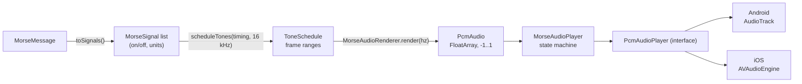
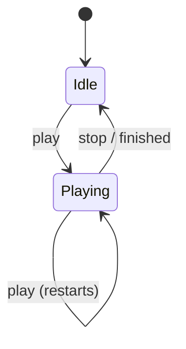
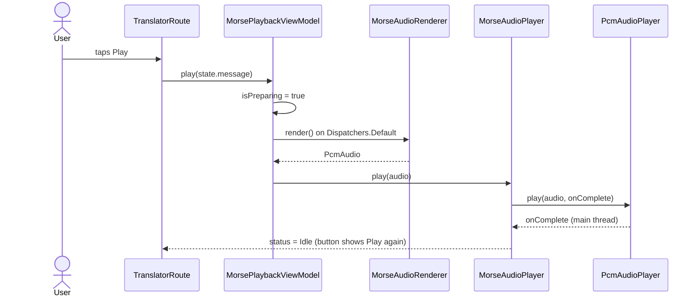

# 8. Audio playback

Morse audio turns the on/off [signals](03-timing-and-signals.md) into a sine tone. **All timing
and sound generation is shared Kotlin**; each platform only plays a buffer of samples through
its native audio API.

## The pipeline



| Stage | File | Shared? | Tested |
| --- | --- | --- | --- |
| Signals | `core/timing/MorseSignal.kt` | ✅ | `MorseTimingTest` |
| Frame schedule | `core/audio/ToneSchedule.kt` | ✅ | `ToneScheduleTest` |
| Tone rendering | `core/audio/MorseAudioRenderer.kt` | ✅ | `MorseAudioRendererTest` |
| Play/stop state | `core/audio/MorseAudioPlayer.kt` | ✅ | `MorseAudioPlayerTest` (fake output) |
| Render off the main thread | `feature/playback/MorsePlaybackViewModel.kt` | ✅ | (thin glue, see below) |
| Play samples | `AndroidPcmAudioPlayer.kt` / `IosPcmAudioPlayer.kt` | ❌ platform | Checked on a device |

## Why render samples instead of switching a tone on and off?

The simple approach is a loop: `tone on → delay(60 ms) → tone off → delay(60 ms) → ...`. But
`delay()` and thread scheduling jitter by several milliseconds. At 20 WPM a dot is 60 ms, so
that's audible as uneven rhythm.

Instead, the whole message is rendered into a buffer first. Timing then comes from the **sample
clock**. At 16 000 samples per second, one frame is 62.5 µs, and the audio hardware plays
samples at exactly that rate. Each platform only has to play the buffer.

| | Toggle with `delay()` | Pre-rendered buffer (used) |
| --- | --- | --- |
| Timing accuracy | ± several ms (scheduler) | ± 31 µs (half a frame) |
| Platform code | Tone generator + timing loop | "Play these samples" |
| Testable without audio | Hard | Yes: inspect the samples |
| Memory | Tiny | ~4 MB per minute (capped at 5 minutes) |

## From units to frames: no drift

```
framesPerUnit = unitSeconds × sampleRate          20 WPM: 0.060 s × 16 000 = 960 frames
```

At 13 WPM, a unit is 92.307… ms = **1476.92… frames**, which isn't a whole number. Rounding each
signal separately would lose a fraction of a frame per signal, and that error grows along the
message. `scheduleTones` rounds each **cumulative** position instead:

```kotlin
fun frameAt(units: Int) = (units * framesPerUnit).roundToInt()
start = frameAt(elapsedUnits); elapsedUnits += signal.units; end = frameAt(elapsedUnits)
```

So every boundary is at most half a frame from exact, however long the message.
`ToneScheduleTest.roundingNeverAccumulates` checks every boundary of a long sentence at 13 WPM.

### Worked example: `A` at 20 WPM, 16 kHz

| Signal | Units | Cumulative units | Frames |
| --- | --- | --- | --- |
| dot (on) | 1 | 0 → 1 | 0 → 960 |
| gap (off) | 1 | 1 → 2 | 960 → 1920 |
| dash (on) | 3 | 2 → 5 | 1920 → 4800 |

The result is `ToneSchedule(tones = [0..960, 1920..4800], totalFrames = 4800)`, and the renderer
adds 100 ms (1600 frames) of silence at each end.

## Rendering the tone

```
sample[i] = AMPLITUDE × envelope(i) × sin(2π × frequency × i / sampleRate)
```

| Constant | Value | Why |
| --- | --- | --- |
| `SAMPLE_RATE` | 16 000 Hz | More than enough for a pure tone of at most 1000 Hz (Nyquist limit 8 kHz); keeps buffers small |
| `AMPLITUDE` | 0.5 | Headroom: loud enough, never clips |
| `RAMP` | 5 ms | Fade in/out of every tone |
| `PADDING` | 100 ms | Silence at both ends, so audio start-up latency (e.g. Bluetooth) doesn't swallow the first dot |
| `MAX_DURATION` | 5 min | Bounds memory; longer messages show an error instead |

### Why the fade (envelope)?

Starting a sine wave at full volume makes a step in the waveform, which you hear as a **click**.
Radio operators call these "key clicks". A 5 ms *raised-cosine* ramp removes them:

```
envelope
  1 ┤    ╭────────────────────╮
    │   ╱                      ╲
  0 ┼──╯                        ╰──
     ←5ms→                    ←5ms→
```

`MorseAudioRendererTest` checks that tones start and end near zero, peak at the amplitude, leave
gaps as exact silence, and have the requested pitch. The pitch check counts zero crossings, so
600 Hz really measures about 600 Hz.

## The state machine



`MorseAudioPlayer` is **synchronous**. Stopping while idle is ignored. Each `play` gets a session
number, so a late "finished" callback from an earlier playback can't stop a newer one; `lateCompletionFromEarlierPlaybackIsIgnored` tests exactly that.

> **Why there's no pause (found on a device).** The first version had Pause/Resume. On the test
> phone, Android's audio log showed the track **muted (`source:clientVolume`) right after
> `AudioTrack.pause()` → `play()`**, and resuming was silent. MorseKit doesn't cause that mute.
> Morse messages are short, so pause wasn't worth a fragile, device-specific path. Sound now works
> like the flashlight and vibration: **Play / Stop playing**. Pause/resume was removed end to end
> (state machine, ViewModel, `PcmAudioPlayer`, both native players), rather than kept as dead
> code.

## The platform contract

```kotlin
interface PcmAudioPlayer {
    fun play(audio: PcmAudio, onComplete: () -> Unit)
    fun stop()
}
```

The rule: **everything happens on the main thread.** Calls come from the main thread, and each
implementation delivers `onComplete` on the main thread, once, only when playback reached the
end. Because of that, the shared state machine needs no locks or atomics.

| | Android | iOS |
| --- | --- | --- |
| API | `AudioTrack`, `MODE_STREAM`, `ENCODING_PCM_FLOAT`, mono | `AVAudioEngine` + `AVAudioPlayerNode`, Float32 mono |
| Feeding samples | Background thread writing 4096-frame chunks (blocking writes) | One `AVAudioPCMBuffer` scheduled on the node |
| Stop | `pause()` + `flush()` + `stop()` + `release()` (flush needs a paused track) | `node.stop()` + `engine.stop()` |
| Completion | Notification marker on the last frame, delivered to a main-thread `Handler` | `scheduleBuffer(..., .dataPlayedBack)`, then `dispatch_async(main)` |
| Stale callbacks | A new `AudioTrack` per play; the listener ignores old tracks | Session counter |
| Audio session | Media usage, sonification content | `AVAudioSessionCategoryPlayback` (plays even with the silent switch on) |
| Permissions | None | None |

> **Kotlin/Native interop in `IosPcmAudioPlayer`.** `buffer.floatChannelData?.get(0)` is a C
> pointer (`CPointer<FloatVar>`), written with `channel[index] = sample`. `dispatch_async` and
> `dispatch_get_main_queue` come from `platform.darwin`, the same Grand Central Dispatch API
> Swift uses.

## Where it's used: the translator



| Behaviour | Where |
| --- | --- |
| Morse → Text plays what you **typed**, including well-formed codes that aren't in the alphabet (`........`); malformed tokens are skipped | `MorseCodec.parse()` |
| Speed slider on the translator = the WPM setting (same value as Settings, saved) | `settingsRepository::setWordsPerMinute` |
| Speed is set with the Transmit FAB's − / + stepper before playing (the audio is rendered at a fixed speed) | `TransmitFab` |
| Editing, swapping, clearing or changing direction stops playback | `TranslatorRoute` |
| Messages over 5 minutes show an error instead of playing | `isTooLongToPlay` |

> **Why is the ViewModel untested?** It uses `viewModelScope`, which needs a main dispatcher.
> Unit tests would need `kotlinx-coroutines-test`, a dependency we don't have. So the ViewModel
> only *orchestrates*: every decision it relies on (rendering, limits, state transitions) is in
> the tested pure code above.

## Verified on a device (Android)

The debug build was tested on a phone with `adb`. Android's own audio service logged:

| Check | Result |
| --- | --- |
| Track format | `channelMask=0x1` (mono), `sampleRate=16000`, `USAGE_MEDIA`, `CONTENT_TYPE_SONIFICATION` |
| `SOS` at 20 WPM | started → stopped after ~1.94 s (1.82 s expected, plus output buffering), then released |
| Stop | the track stops and is released immediately |
| UI | Play → Stop playing → Play, and back to Play when finished |
| Pause/resume (removed) | `paused` → `started` was logged, but the track was muted and silent after resuming |

On iOS the code compiles against the real `AVFAudio` bindings, but it hasn't run yet (no Xcode
on the development machine).
