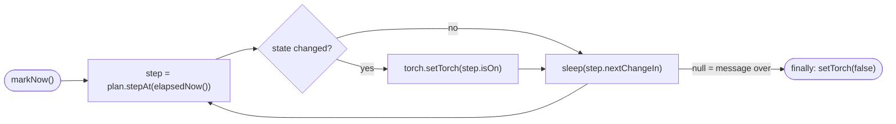

# 9. Flashlight transmission

The flashlight sends Morse as light: torch on for dots and dashes, off for gaps. As with audio,
**all timing is shared Kotlin**. The platforms only switch the LED on or off.

## Why it can't work like audio

Audio is pre-rendered into samples, and the audio hardware's clock does the timing (see
[Audio playback](08-audio-playback.md)). A torch has no such clock: the app has to switch it at
the right moments itself, from a coroutine.

The naive loop chains delays:

```kotlin
torch(on); delay(60.ms); torch(off); delay(60.ms); torch(on); delay(180.ms) ...   // ❌ drifts
```

Every `delay()` wakes up a little late (the main thread was busy, the scheduler was slow), and
the lateness **adds up** along the message. MorseKit instead asks *"what should the torch be
doing right now?"* on every wake-up:



A late wake-up only delays *that* switch. The next wait is computed from the real elapsed time,
so it's automatically shorter. `lateWakeUpsDoNotAccumulate` checks this: with every sleep
overrunning by 7 ms, each switch is 7 ms late, not 7, 14, 21 ms.

## The pieces

| Piece | File | Kind | Tested in |
| --- | --- | --- | --- |
| `TorchPlan.stepAt(elapsed)` | `core/torch/TorchPlan.kt` | Pure function of time | `commonTest/TorchPlanTest` (11) |
| `transmitWithTorch(plan, torch, clock, sleep)` | `core/torch/TorchTransmitter.kt` | Suspend loop | `androidHostTest/TorchTransmitterTest` (6) |
| `TorchController` | `platform/TorchController.kt` | Interface | (fakes in tests) |
| `AndroidTorchController` | `androidMain/.../AndroidTorchController.kt` | `CameraManager.setTorchMode` | Checked on a device |
| `IosTorchController` | `iosMain/.../IosTorchController.kt` | `AVCaptureDevice.torchMode` | Compiles against AVFoundation |
| `MorseTorchViewModel` | `feature/playback/MorseTorchViewModel.kt` | Start/stop/report | (thin glue) |

### `TorchPlan`: what should happen at time *t*?

```kotlin
data class TorchStep(val isOn: Boolean, val nextChangeIn: Duration?)   // null = finished
```

For `A` at 20 WPM (60 ms unit): on 0–60 ms, off 60–120 ms, on 120–300 ms.

| `stepAt(...)` | Result |
| --- | --- |
| `0 ms` | on, next change in 60 ms |
| `90 ms` | off, next change in 30 ms |
| `120 ms` | on, next change in 180 ms (a boundary belongs to the *next* signal) |
| `300 ms` or later | off, `null` (finished) |

The end of each signal is `unit × cumulative units`, so boundaries don't drift. Lookup is a
binary search, so even long messages cost almost nothing per wake-up.

## Testing a suspend function without a coroutine test library

`transmitWithTorch` suspends (it calls `delay`), and `commonTest` has no way to run suspend code
without adding `kotlinx-coroutines-test`. Two tricks avoid the dependency:

1. **Inject time.** The runner takes a `clock: TimeSource` and a `sleep: suspend (Duration) -> Unit`.
   Tests pass `TestTimeSource` (from the Kotlin standard library) and a `sleep` that just
   advances it. No real waiting happens, and results are exact.
2. **Run on the JVM host.** `runBlocking` exists on the JVM, so the runner tests live in
   `shared/src/androidHostTest/`. That's the first use of that source set; it runs with
   `./gradlew :shared:testAndroidHostTest`.

```kotlin
@Test
fun switchesAtExactSignalBoundariesAndEndsOff() = runBlocking {
    transmitWithTorch(plan("A"), torch, clock, sleep = { clock += it })
    assertEquals(listOf(0.ms to true, 60.ms to false, 120.ms to true, 300.ms to false, 300.ms to false), torch.switches)
}
```

The logic is still in `commonMain`, so it's shared by both platforms; only the *test* is
JVM-specific.

## Safety: never flashing unattended

| Guard | Where |
| --- | --- |
| The torch is turned off in `finally`, on completion, cancellation **and** failure | `transmitWithTorch` |
| Leaving the Translator tab stops it (`DisposableEffect.onDispose`) | `TranslatorRoute` |
| The app going to the background stops it (`LifecycleEventEffect(ON_STOP)`) | `TranslatorRoute` |
| Destroying the ViewModel stops it and switches the torch off | `MorseTorchViewModel.onCleared` |
| Editing, swapping, clearing or changing direction stops it | `TranslatorRoute` |
| A new transmission waits for the previous one to switch off first (`cancelAndJoin`), so two can never overlap | `MorseTorchViewModel.start` |
| Messages over 5 minutes are refused | `TorchPlan.isTooLong` |
| A visible photosensitive-epilepsy warning next to the button | `TorchControls` |
| If the process dies, Android switches the torch off itself | Android camera service |

> **Concept: `CoroutineStart.LAZY` in the ViewModel.** `viewModelScope` runs on
> `Dispatchers.Main.immediate`, so a launched body starts running *before* `launch` returns. If
> the torch failed instantly, the `finally` block would run before `job` was assigned and would
> miss its bookkeeping. Launching lazily, assigning `job`, then calling `start()` removes that race.

## Devices without a torch, and failures

| Situation | What the user sees |
| --- | --- |
| No flash unit (most tablets, emulators) | "Flash" disabled, "This device doesn't have a flashlight." |
| Another app holds the camera / iOS limits the torch (overheating) | Transmission stops: "The flashlight stopped responding. Another app may be using the camera." |

On Android, `setTorchMode` needs **no camera permission**. It throws `CameraAccessException`
when the camera is busy, which `AndroidTorchController` turns into `false`. On iOS, setting an
unsupported torch mode raises an Objective-C exception, which Kotlin can't catch, so
`IosTorchController` checks `hasTorch`, `isTorchModeSupported` and `torchAvailable` first.

## UI: the Transmit card

The translator's card is now **Transmit**: one **Speed** slider shared by both outputs (the
saved WPM setting, locked while any output is running), then **Sound** (Play / Stop playing),
**Flashlight** (Flash / Stop flashing, plus the warning) and **Vibration**. All three use one
shared start/stop layout.

## Known limitations

- **Screen timeout.** If the screen turns off during a long, slow message, the app goes to the
  background and flashing stops (by design, see the table above). Keeping the screen on while
  transmitting needs a platform hook and isn't done yet (backlog: *Flashlight / Screen timeout*,
  P3, after v1).
- **Rotation** recreates the screen, which also stops flashing (backlog: *Flashlight / Rotation*,
  P3, after v1).
- **LED latency.** Torch LEDs take a few milliseconds to switch, which is fine for Morse that
  people read by eye.
- **iOS** hasn't run on a device yet (no Xcode on the development machine).
