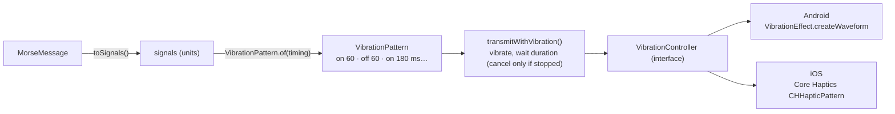

# 10. Vibration transmission

Vibration sends Morse as touch: buzz for dots and dashes, stillness for gaps. It follows the
[flashlight](09-flashlight.md)'s structure (shared timing, a thin platform controller, a thin
ViewModel, the same safety stops), with one important difference in *who keeps time*.

## Why it doesn't use the flashlight's loop

| | Flashlight | Vibration | Audio |
| --- | --- | --- | --- |
| Native "play a timed pattern" API | ❌ on/off only | ✅ waveform / haptic pattern | ✅ sample buffer |
| Who keeps time | Shared time-driven loop | **The OS vibration timeline** | The audio clock |
| Shared code produces | `TorchPlan` (on/off at time *t*) | `VibrationPattern` (whole pattern) | `PcmAudio` (samples) |

Driving the motor per dot from a loop would add start-up latency to every element. Both
platforms can play a whole timed pattern natively, so shared code builds the **complete
pattern** and the platform plays it in one call. The rule behind all three outputs: **use the
most precise clock the platform offers, and keep everything else shared.**



## The pattern: whole milliseconds, no drift

Android's waveform API takes **whole milliseconds**, so the pattern is in milliseconds. At
13 WPM a unit is 92.307… ms, so rounding each segment separately would drift. As with audio
frames, each **cumulative** boundary is rounded instead:

```kotlin
units += signal.units
val boundary = (units * unitMillis).roundToLong()
VibrationSegment(signal.isOn, boundary - previousBoundary)
```

`millisecondRoundingNeverAccumulates` checks that every boundary of a long sentence is within
0.5 ms of exact.

| `A` at 20 WPM | on 60 | off 60 | on 180 |
| --- | --- | --- | --- |
| Android waveform `timings` | `[0,` (initial delay) `60,` | `60,` | `180]` |
| iOS haptic events | continuous event at 0.000 s for 0.060 s | | continuous event at 0.120 s for 0.180 s |

## The runner

```kotlin
suspend fun transmitWithVibration(pattern, vibration, sleep = { delay(it) }) {
    var finished = false
    try {
        if (!vibration.vibrate(pattern)) throw VibrationFailedException()
        sleep(pattern.duration)          // the OS is playing it; we just wait
        finished = true
    } finally {
        if (!finished) vibration.cancel() // stopped, cancelled or failed
    }
}
```

Neither platform tells the app when a pattern has finished, so the runner waits for the
pattern's known duration. That's also how the UI knows to switch "Stop vibrating" back to
"Vibrate".

> **Found on a real device.** The first version *always* called `cancel()` at the end. Android's
> vibrator log then showed complete messages as `cancelled_by_user`: the OS starts the pattern a
> few milliseconds after `vibrate()` returns (7 ms on the test phone), so a cancel exactly one
> pattern-length later landed just before the pattern's own end and could clip the final dot. A
> pattern that finishes normally now ends by itself; `cancel()` is only for stop, cancellation
> and failure.

## Shared start/stop logic: `TransmissionRunner`

The flashlight ViewModel had subtle ordering logic: a new transmission must wait for the previous
one's cleanup, and a stale finish mustn't clear a newer run's state. Vibration needs exactly the
same, so it moved into one class that both ViewModels use:

```kotlin
class TransmissionRunner(scope: CoroutineScope) {
    var isRunning: Boolean      // Compose state
    fun start(transmission: suspend () -> Unit)
    fun stop()
}
```

It takes a plain `CoroutineScope`, so it's tested on the JVM host with real coroutines under
`runBlocking`: `newTransmissionWaitsForThePreviousCleanup` and `staleFinishDoesNotClearANewerRun`.
The ViewModels pass `viewModelScope`. That logic used to sit untested inside the torch
ViewModel; extracting it gave it tests.

## Platform implementations

| | Android | iOS |
| --- | --- | --- |
| API | `Vibrator.vibrate(VibrationEffect.createWaveform(timings, -1))` | Core Haptics: one `CHHapticEventTypeHapticContinuous` event per "on" segment in a `CHHapticPattern` |
| Getting the device | `VibratorManager.defaultVibrator` (API 31+), else `Vibrator` | `CHHapticEngine`, restarted on each play (iOS stops it in the background) |
| Available when | `hasVibrator()` | `CHHapticEngine.capabilitiesForHardware().supportsHaptics` (iPhone 8 and later; not iPads) |
| Cancel | `vibrator.cancel()` | `player.stopAtTime(CHHapticTimeImmediate)` |
| Permission | `VIBRATE` (normal, granted at install) | None |

> **Kotlin/Native lesson: overload ambiguity.** `CHHapticPattern` has two initializers with the
> same parameter types: `initWithEvents:parameters:error:` and
> `initWithEvents:parameterCurves:error:`. A positional call `CHHapticPattern(events, list, null)`
> doesn't compile ("overload resolution ambiguity"). **Named arguments** pick one:
> `CHHapticPattern(events = events, parameters = emptyList<Any>(), error = null)`. Objective-C
> selector parts become Kotlin parameter names, which is what makes this possible.

## Permissions

`VIBRATE` is MorseKit's first and only permission. It's declared, with a comment explaining why,
in `androidApp/src/main/AndroidManifest.xml`. It's a *normal* permission: granted at install,
with no prompt, and users can't revoke it.

| Permission | Why | Where declared |
| --- | --- | --- |
| `android.permission.VIBRATE` | Vibration transmission | `androidApp` manifest |
| `…DYNAMIC_RECEIVER_NOT_EXPORTED_PERMISSION` | Added automatically by AndroidX for internal broadcast receivers; signature-level, never shown to users | Merged from AndroidX |

The flashlight (`CameraManager.setTorchMode`), audio, clipboard and share need no permissions.

## Safety and UI

Vibration uses the same guards as the flashlight: it stops when you leave the tab, when the app
goes to the background, when the ViewModel is cleared, and when the content changes. Messages
over 5 minutes are refused. In the UI it's the **Vibrate** option of the Transmit floating button,
which becomes **Stop vibrating** while it runs (see [Translator UI](11-translator-ui.md)).
