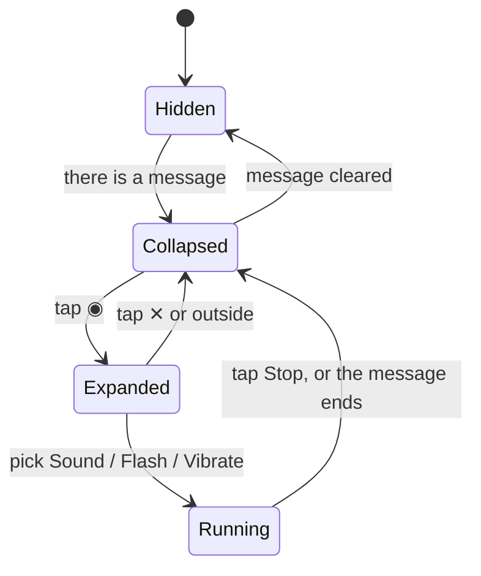

# 11. Translator UI

The translator was redesigned so everything fits on one screen, with each action placed next to
the thing it acts on. It borrows from Google Translate's layouts: a language bar with the swap
in the middle, a clear button on the input, and action icons inside the result card.

## Before and after

| | Before | After |
| --- | --- | --- |
| Direction | Segmented buttons: `Text → Morse` / `Morse → Text` | Bar: `Text ⇄ Morse`, where ⇄ swaps (the arrows turn half a turn) |
| Clear | Button at the bottom of the screen | ✕ in the input card's header (only when there's input) |
| Copy / Share | Buttons at the bottom of the screen | Icons in the output card, under the result |
| Swap | Button at the bottom of the screen | ⇄ in the direction bar |
| Transmit | A card with a speed slider plus Sound, Flashlight and Vibration sections (needed scrolling) | A **floating action button** (FAB) speed dial |
| Errors | Red text inside the Transmit card | Snackbars |
| Flash warning | A caption that was always visible | A one-time dialog before the first flash |

```
┌──────────────────────────────┐
│          Translator          │
│  ( Text )     ⇄    ( Morse ) │   DirectionBar
│ ┌──────────────────────────┐ │
│ │ Text                   ✕ │ │   InputCard: header + borderless MorseTextField
│ │ HELLO                    │ │
│ └──────────────────────────┘ │
│ ┌──────────────────────────┐ │
│ │ Morse                    │ │   OutputCard (primaryContainer)
│ │ •••• • •−•• •−•• −−−     │ │
│ │                   ⧉   ⤴  │ │   copy, share
│ └──────────────────────────┘ │
│                         (◉)  │   TransmitFab
└──────────────────────────────┘
```

## The Transmit FAB



| State | Looks like |
| --- | --- |
| Hidden | Nothing: there's nothing to send |
| Collapsed | ◉ FAB |
| Expanded | Dimmed backdrop, **− 20 WPM +** stepper, then Sound / Flash / Vibrate (label + small FAB each) |
| Running | Red extended FAB: **■ Stop sound**, **Stop flashing** or **Stop vibrating** |

- **One output at a time.** Starting one stops the others (`start()` in `TranslatorRoute` calls
  `stopTransmitting()` first), so the FAB always has a single clear Stop action.
- **Unavailable outputs** are greyed out with a reason ("No flashlight", "Can't vibrate") and
  marked `disabled()` for screen readers.
- **The backdrop** closes the menu on tap but has no semantics; the FAB's ✕ is the accessible way
  to close it.
- `TransmitFab` fills its parent so it can draw the backdrop. It's placed last in a `Box` over the
  content, and the column ends with an 88 dp spacer so the output card's icons are never hidden
  behind the FAB.

### The speed stepper

Instead of a slider, **−** and **+** move along a fixed ladder of practical speeds:

```
5 · 8 · 10 · 12 · 13 · 15 · 18 · 20 · 25 · 30 · 35 · 40 · 45 · 50 · 60 WPM
```

Going from 20 to 60 WPM takes 7 taps rather than 40. A value between steps (e.g. 17, set with
the Settings slider) snaps to the next step in the chosen direction. `stepWpm()` is a pure
function with its own tests (`StepWpmTest`). It still writes the same saved WPM setting as
Settings.

### The one-time flash warning

The first time Flash is picked, an `AlertDialog` explains the photosensitivity risk. **Flash**
confirms and saves `flashWarningAcknowledged = true` in `AppSettings`, and **Cancel** does
nothing. The answer persists through the `KeyValueStore`, which gained `getBoolean`/`putBoolean`
for this (`SharedPreferences.getBoolean`, `NSUserDefaults.boolForKey`).

## Compose techniques used

| Technique | Where | Why |
| --- | --- | --- |
| `AnimatedVisibility(fadeIn() + scaleIn())` | Speed-dial options | The menu grows out of the FAB instead of popping in |
| `animateFloatAsState` + `Modifier.rotate` | ⇄ swap icon | A half turn per swap shows the direction flipped |
| `rememberSaveable` | Whether the FAB menu is open | Survives rotation |
| `pointerInput { detectTapGestures }` | Backdrop | Tap-to-dismiss without adding a screen-reader target |
| `Surface(onClick, enabled)` | Option labels | Tapping the label starts the output too (a bigger touch target) |
| Borderless `TextField` (transparent container and indicators) | `MorseTextField(borderless = true)` | The card is the frame, so a field outline would be redundant |
| `LocalContentColor` | Card headers and placeholders | Text adapts to whichever card colour it sits on |
| `Modifier.semantics { heading() }` | Card titles | Screen readers can jump between sections |
| Slot parameter `transmitFab: @Composable () -> Unit` | `TranslatorScreen` | The screen stays stateless and previewable; the route supplies the stateful FAB |

## Icons

All icons are Material Design paths saved as vector XML in `composeResources/drawable/`
(`ic_close`, `ic_copy`, `ic_share`, `ic_stop`, `ic_volume`, `ic_flashlight`, `ic_vibration`,
`ic_transmit`, `ic_add`, `ic_remove`), plus the existing `ic_translate` arrows for swap. No icon
library was added.

## Headers on every screen

Each screen draws its own top app bar (default surface colours) through the shared
`ui/components/ScreenScaffold`, and the bar extends up under the status bar. The home screen's is
centred (`centerTitle = true` → `CenterAlignedTopAppBar`); the others are left-aligned.

| Screen | Title | Actions |
| --- | --- | --- |
| Translator (home) | App icon + **MorseKit**, centred | none (transmitting is the FAB) |
| Reference | **Reference** | 🔍 turns the header into the search field; ← closes it (and clears the query), ✕ clears the text |
| Settings | **Settings** | ⋮ → **Reset to defaults** (confirmed first; theme, speed and tone reset, the flash-warning acknowledgement is kept) |

> **Insets, done once.** The app-level `Scaffold` only owns the bottom navigation and uses
> `contentWindowInsets = WindowInsets(0)`. Each `ScreenScaffold` also uses zero insets, and its
> `TopAppBar` pads itself for the status bar. Without that split, the status-bar or
> navigation-bar padding gets applied twice, or not at all (content drawn under the status bar).

> **Status bar icons follow the in-app theme, not the system's.** The status bar is transparent
> over the header, so its icons must contrast with the header's colour. `App` computes a
> `SystemBarAppearance` from the real colours (`surface.luminance() < 0.5` → light icons) and
> `MainActivity` applies it with `enableEdgeToEdge`. Choosing Dark in Settings while the phone is
> in light mode still gets light icons. (An earlier version had a primary-coloured header; working
> from the actual colour rather than "dark theme or not" meant only one line changed when it went.)

## App icon

The Android launcher icons were made with Android Studio's **New › Image Asset** wizard from the
MorseKit logo. It writes the adaptive icon (`mipmap-anydpi-v26/ic_launcher*.xml`), a foreground
and legacy icons as `.webp` in every density, and the 512 px Play Store icon at
`androidApp/src/main/ic_launcher-playstore.png`.

The **header logo** is a separate copy, because Compose Multiplatform resources can't read Android
`res/` (they must work on iOS too). It's derived from the Play Store icon with ImageMagick:

```bash
magick androidApp/src/main/ic_launcher-playstore.png -resize 144x144 \
  \( -size 144x144 xc:none -fill white -draw "roundrectangle 0,0 143,143 32,32" \) \
  -alpha set -compose DstIn -composite -strip \
  shared/src/commonMain/composeResources/drawable/morsekit_logo.png
```

**If the logo changes, re-run the wizard and this command**, or the header shows the old logo.

Two wizard defaults were then fixed by hand. **Check them again after any re-run**, because the
wizard overwrites both:

| Layer | Wizard default | Now |
| --- | --- | --- |
| Background | The template's green grid (`#3DDC84`), which can show at the edges in launcher animations | `@color/ic_launcher_background` = `#023A9E`, the tile's mid-edge blue |
| Monochrome (Android 13+ themed icons) | The full-colour foreground, which the system tints into a featureless tile | `mipmap-*/ic_launcher_monochrome.webp`: the mark alone, white on transparent |

The monochrome glyph is cut out of each density's foreground, so it lines up exactly. The mark's
pixels have a red or green channel above 45% (white and cyan bars, yellow and orange dots) while
the blue tile stays below 41%, so a soft threshold on `max(R, G)` separates them:

```bash
magick mipmap-$d/ic_launcher_foreground.webp -alpha set -channel A \
  -fx "a*min(1,max(0,(max(r,g)-0.45)/0.2))" +channel -fill white -colorize 100 \
  -define webp:lossless=true mipmap-$d/ic_launcher_monochrome.webp
```

The **iOS** `AppIcon` is still the project template's (backlog: *Release / App icon*).

