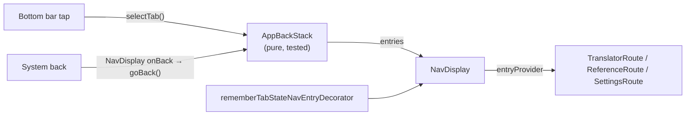

# 12. Navigation

MorseKit uses **Navigation 3** (`org.jetbrains.androidx.navigation3:navigation3-ui` 1.1.2,
JetBrains' multiplatform build of Jetpack Navigation 3; on Android it maps to
`androidx.navigation3` 1.1.7). Unlike Navigation Compose's `NavController`, Navigation 3 renders a
back stack **you own**, so the navigation rules are ordinary, testable Kotlin.

## The pieces



| File | Role |
| --- | --- |
| `navigation/AppBackStack.kt` | Current tab, the back rules, and a `Saver` (rotation, process death) |
| `navigation/TabStateNavEntryDecorator.kt` | Keeps each tab's saved state when you switch tabs |
| `App.kt` | `NavDisplay(backStack = backStack.entries, onBack = { backStack.goBack() }, …)` |
| `feature/reference/ReferenceScreen.kt` | `NavigationBackHandler`: back closes search first |

## Back rules (Material bottom navigation)

| You're on | Back does |
| --- | --- |
| Reference or Settings | Goes to the Translator |
| Reference, with search open | Closes the search (and clears the query) |
| Translator | Leaves the app |

`AppBackStack.entries` is `[Translator]` on the start tab and `[Translator, currentTab]` on any
other tab. `NavDisplay` intercepts system back **only when its back stack has more than one
entry**, so this list shape makes the rules above happen automatically.
`AppBackStackTest.inAppBackIsExactlyWhenThereIsMoreThanOneEntry` pins that relationship down.

Switching between Reference and Settings replaces the top entry rather than stacking, so back
from either always returns to the Translator. Tabs don't build up history.

## Keeping tab state

Navigation 3's default `SaveableStateHolderNavEntryDecorator` calls `removeState` when an entry
**leaves the back stack**. With the list shape above, a tab leaves the stack every time you pick
another tab, so the default would reset it on every switch (Reference would lose its scroll
position and search). `rememberTabStateNavEntryDecorator` is the same decorator with an empty
`onPop`, so tab state is kept. When detail screens are added (History → entry), their state
should still be removed on pop.

## Back inside a screen: `navigationevent`

Screen-level back handling uses `androidx.navigationevent` (`navigationevent-compose`, declared
explicitly), the multiplatform successor to Android's `BackHandler`:

```kotlin
NavigationBackHandler(
    state = rememberNavigationEventState(currentInfo = NavigationEventInfo.None),
    isBackEnabled = searching,          // only intercept while search is open
    onBackCompleted = closeSearch,
)
```

A handler registered deeper in the UI takes priority over `NavDisplay`'s, so back closes the
search before any tab navigation happens.

## Adding a detail screen later

1. Introduce a route type for the back stack (e.g. `sealed interface Route` with the tabs and
   `data class HistoryEntry(val id: Long)`), and give each tab its own stack in `AppBackStack`,
   with back popping it first.
2. Save routes with arguments: the kotlinx-serialization plugin plus Navigation 3's saved back
   stack, or extend `AppBackStack.Saver`.
3. Make the decorator remove state for popped detail screens (keep it for tabs).
4. Add an `entry<HistoryEntry> { … }` to the `entryProvider` in `App.kt`.

## How the version was chosen

Both 1.1.2 (stable) and 1.2.0-beta01 require Compose Multiplatform ≥ 1.10 (MorseKit uses 1.12.1)
and `navigationevent-compose` 1.1.0, which Compose already brings in. 1.1.2 was chosen as the
latest stable release. The API was checked against the published source jars before writing
code (`NavDisplay`, `entryProvider`, `NavEntryDecorator`, `NavigationBackHandler`).
