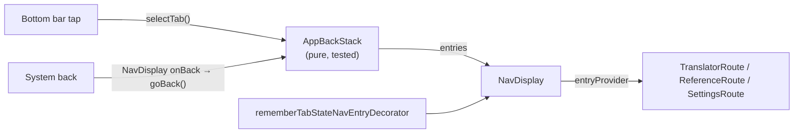
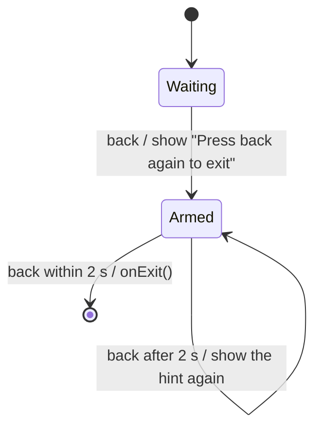

# 12. Navigation

MorseKit uses **Navigation 3** (`org.jetbrains.androidx.navigation3:navigation3-ui` 1.1.2,
JetBrains' multiplatform build of Jetpack Navigation 3; on Android it maps to
`androidx.navigation3` 1.1.7). Unlike Navigation Compose's `NavController`, Navigation 3 renders a
back stack **you own**, so the navigation rules are ordinary, testable Kotlin.

## The pieces



| File | Role |
| --- | --- |
| `navigation/AppBackStack.kt` | Current tab, the back rules, and a `Saver` (rotation, process death) |
| `navigation/TabStateNavEntryDecorator.kt` | Keeps each tab's saved state when you switch tabs |
| `App.kt` | `NavDisplay(backStack = backStack.entries, onBack = { backStack.goBack() }, …)` |
| `feature/reference/ReferenceScreen.kt` | `NavigationBackHandler`: back closes search first |

## Back rules (Material bottom navigation)

| You're on | Back does |
| --- | --- |
| Reference or Settings | Goes to the Translator |
| Reference, with search open | Closes the search (and clears the query) |
| Translator | Shows "Press back again to exit"; a second back within 2 s leaves the app (Android) |

`AppBackStack.entries` is `[Translator]` on the start tab and `[Translator, currentTab]` on any
other tab. `NavDisplay` intercepts system back **only when its back stack has more than one
entry**, so this list shape makes the rules above happen automatically.
`AppBackStackTest.inAppBackIsExactlyWhenThereIsMoreThanOneEntry` pins that relationship down.

Switching between Reference and Settings replaces the top entry rather than stacking, so back
from either always returns to the Translator. Tabs don't build up history.

## Exit confirmation ("press back again")

On the start screen, back would leave the app, so `TranslatorRoute` registers a
`NavigationBackHandler` that asks for a second press first. `NavDisplay` doesn't intercept back
there (only one entry), so this handler gets it. On other tabs the translator isn't composed, so
the handler isn't registered at all.



| Piece | Where |
| --- | --- |
| The rule (2 s window, injectable clock) | `navigation/ExitConfirmation.kt`, tested with `TestTimeSource` |
| The handler and snackbar | `TranslatorRoute` (its snackbar already sits clear of the Transmit FAB) |
| Actually leaving | `App(onExit = …)`. Android's `MainActivity.exitApp()` does what the system does: `moveTaskToBack(true)` on Android 12+ (the app stays warm), `finish()` before that |
| iOS | Passes no `onExit`, so the handler is disabled; there's no back button to confirm |

The window matches a short snackbar's display time, so the hint is on screen for the whole time
a second press counts.

## Keeping tab state

Navigation 3's default `SaveableStateHolderNavEntryDecorator` calls `removeState` when an entry
**leaves the back stack**. With the list shape above, a tab leaves the stack every time you pick
another tab, so the default would reset it on every switch (Reference would lose its scroll
position and search). `rememberTabStateNavEntryDecorator` is the same decorator with an empty
`onPop`, so tab state is kept. When detail screens are added (History → entry), their state
should still be removed on pop.

## Back inside a screen: `navigationevent`

Screen-level back handling uses `androidx.navigationevent` (`navigationevent-compose`, declared
explicitly), the multiplatform successor to Android's `BackHandler`:

```kotlin
NavigationBackHandler(
    state = rememberNavigationEventState(currentInfo = NavigationEventInfo.None),
    isBackEnabled = searching,          // only intercept while search is open
    onBackCompleted = closeSearch,
)
```

A handler registered deeper in the UI takes priority over `NavDisplay`'s, so back closes the
search before any tab navigation happens.

## Detail screens

History ([note 18](18-history.md)) is the first screen opened *from* a tab rather than from the
bottom bar. `AppBackStack` keeps one optional `DetailScreen` per tab:

| Rule | Behaviour |
| --- | --- |
| Open | `open(DetailScreen.History)` puts it on top of the current tab |
| Back | Closes the current tab's detail screen first, then the usual tab rules |
| Switching tabs | Each tab keeps its detail screen: Translator › History, then Learn, then back returns to History |
| Re-selecting the current tab | Closes its detail screen (back to the tab's root) |
| `entries` | The start tab and its detail, then the current tab and its detail: a mix of `TopLevelDestination` and `DetailScreen` keys |
| Saving | `Tap|Translator=History`: the current tab, then each tab's detail; unknown names are dropped |

**State.** The decorator keeps tabs' saved state when they leave the back stack (see above) but
removes a detail screen's when it closes, so History opens fresh. Navigation 3's `onPop` receives
the entry's *content key*, not the route (its default is an internal `Pair` of the key's text and
class), so detail entries get an explicit one: `entry<DetailScreen>(clazzContentKey = { it.contentKey })`
gives `"detail:History"`, and `onPop` removes state only for keys with that prefix.

## How the version was chosen

Both 1.1.2 (stable) and 1.2.0-beta01 require Compose Multiplatform ≥ 1.10 (MorseKit uses 1.12.1)
and `navigationevent-compose` 1.1.0, which Compose already brings in. 1.1.2 was chosen as the
latest stable release. The API was checked against the published source jars before writing
code (`NavDisplay`, `entryProvider`, `NavEntryDecorator`, `NavigationBackHandler`).
