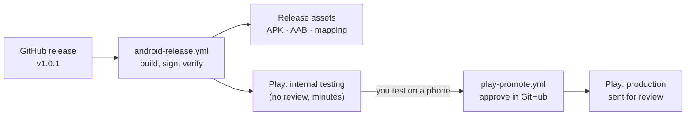
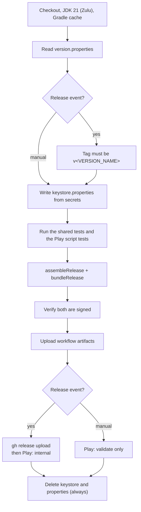
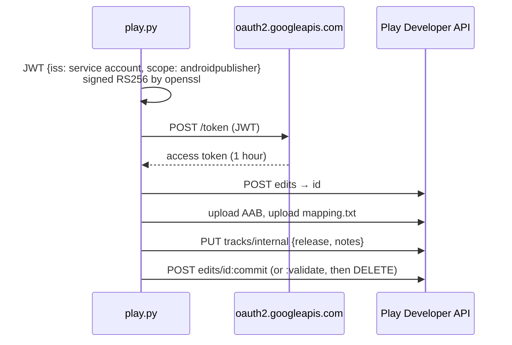

# 13. Release builds on GitHub Actions and Google Play

Two workflows take a release from a GitHub tag to Google Play without a laptop in the loop:

| Workflow | Trigger | Does |
| --- | --- | --- |
| `android-release.yml` | **Publish a GitHub release** | Builds the signed APK, AAB and R8 mapping file, attaches them to the release, uploads the AAB to Play's **internal testing** track |
| | **Run workflow** (manual) | Same build, kept as workflow artifacts; Play only **validates** the upload (nothing is published) |
| `play-promote.yml` | **Run workflow** (manual, approved) | Copies a release from internal testing to **production** and sends it for review |



The files use the same names as local builds ([note 7](07-versioning-and-builds.md)):

```
MorseKit-v1.0.0-5-release.apk            install directly (sideload)
MorseKit-v1.0.0-5-release.aab            what Play gets
MorseKit-v1.0.0-5-release-mapping.txt    also sent to Play, to read crash stack traces
```

## The build (`android-release.yml`)



- **The tag guard.** A release tagged `v1.2.0` must build `VERSION_NAME=1.2.0`, so tagging the
  wrong commit fails early instead of shipping the wrong version. A suffix is allowed for
  build-only releases: `v1.0.0+5`, `v1.0.0-rc1`.
- **Signed or nothing.** Locally, a missing `keystore.properties` gives an unsigned build (so a
  fresh clone still builds). In CI that would be a silent mistake, so a missing secret fails the
  job, and `apksigner` / `jarsigner` check the outputs before anything is uploaded. The log shows
  the certificate's SHA-256, which is public (Play shows it too), never the passwords.
- **The same build as local.** CI writes the same `keystore.properties` the Gradle build already
  reads, so there's no CI-only signing path. Backslashes in passwords are doubled because
  properties files treat `\` as an escape.
- **Tests first.** The shared tests and `scripts/play` tests run before the build; a failure
  stops the release.
- **Play is optional until it's set up.** Without `PLAY_SERVICE_ACCOUNT_JSON`, the Play step
  prints a notice and the rest of the release still happens.

## Google Play

### Tracks, and why internal first

| Track | Review | Who gets it |
| --- | --- | --- |
| Internal testing | None; available in minutes | Up to 100 testers you list in Play Console |
| Production | Google's review (hours to days) | Everyone, or a percentage with a staged rollout |

Every GitHub release goes to **internal testing** automatically. After installing it from Play
and trying it, you promote the **same build** (same version code, no rebuild) to production.

### Release notes

The GitHub release body becomes Play's **What's new** (en-US), converted by
`to_play_notes()` in `scripts/play/play.py`:

| GitHub release body (Markdown) | Play "What's new" (plain text) |
| --- | --- |
| `## Highlights` | `Highlights` |
| `- **Check for updates** in Settings` | `• Check for updates in Settings` |
| `[the docs](https://…)`, `` `code` ``, `*italic*` | `the docs`, `code`, `italic` |
| `<!-- note to self -->`, images | removed |
| GitHub's generated `… by @user in https://…/pull/3`, *New Contributors*, *Full Changelog* | removed |
| Empty body | `Bug fixes and improvements.` |
| Over 500 characters (Play's limit) | cut at a line or word, ending with `…` |

Preview it before releasing:

```bash
gh release view v1.0.1 --json body --jq .body | python3 scripts/play/play.py notes
```

### Promoting to production (`play-promote.yml`)

Actions › **Promote to production** › Run workflow:

| Input | Default | Meaning |
| --- | --- | --- |
| Version code | newest on internal | Which internal release to promote |
| Rollout | `100` | Percent of users. Below 100 is a staged rollout; run again with a higher number (same version code) to widen it, and `100` finishes it |
| In-app update priority | `0` | Play's 0–5 priority, read by MorseKit's in-app updates: **4–5 make the app ask for an immediate update** (`AvailableUpdate.isUrgent`, [note 5](05-platform-services.md)). Use it for serious bugs only |
| Dry run | off | Play validates the change, then it's discarded |

The job runs in the `production` **environment**. With required reviewers set on it (below),
GitHub pauses the run until you approve it, so a stray click can't ship. The run's summary shows
the release, rollout, priority and notes that were sent.

Committing a production change **sends it for review**. It goes live when review passes, unless
**Managed publishing** is on in Play Console, in which case you press Publish there.

### Why a script instead of an action or Fastlane

The service-account key can publish the app, so it should reach as little code as possible.
`scripts/play/play.py` uses only the Python standard library, plus the runner's `openssl` to sign
the login:



An **edit** is Play's transaction: nothing is visible until the commit, and a failure deletes the
edit, so a half-finished upload never shows up. `test_play.py` runs the script against a fake
Play API (it replaces `urlopen`, so no network): it checks the JWT signature, the exact requests,
dry runs, failures and the release-notes conversion. The fake answers a body-less POST with
HTTP 411 like Google's servers do; that caught a real bug (urllib omits `Content-Length` when there's no
body).

| Alternative | Trade-off |
| --- | --- |
| `r0adkll/upload-google-play` action | Popular, but third-party code receives the key; upload only, no promotion |
| Gradle Play Publisher (plugin) | Rich, but adds a build plugin and the key to Gradle |
| Fastlane `supply` | Full-featured; installs Ruby gems on every run |

## One-time setup

### 1. Signing secrets

Add these **repository secrets** (GitHub › Settings › Secrets and variables › Actions), or use
`gh` from the repo folder. Each `gh secret set NAME` prompts for the value, so passwords don't
land in shell history:

```bash
base64 -i ~/Desktop/MorseKit.jks | gh secret set KEYSTORE_BASE64
gh secret set KEYSTORE_PASSWORD
gh secret set KEY_ALIAS
gh secret set KEY_PASSWORD
```

| Secret | Value |
| --- | --- |
| `KEYSTORE_BASE64` | The `.jks` file, base64-encoded (secrets are text) |
| `KEYSTORE_PASSWORD` | `storePassword` from `keystore.properties` |
| `KEY_ALIAS` | `keyAlias` |
| `KEY_PASSWORD` | `keyPassword` |

### 2. Google Play access

1. **Create the app in Play Console and upload the first AAB by hand** (any track). The API can't
   create an app or make its first release. New personal developer accounts must also run a
   closed test (12+ testers for 14 days) before production is unlocked.
2. **Google Cloud Console:** create (or pick) a project, enable the **Google Play Android
   Developer API**, create a **service account**, and add a **JSON key** for it.
3. **Play Console › Users and permissions › Invite new users:** the service account's email,
   with access to MorseKit and the **Release to testing tracks** and **Release to production**
   permissions (nothing else is needed).
4. Store the key, then delete the downloaded file:

   ```bash
   gh secret set PLAY_SERVICE_ACCOUNT_JSON < ~/Downloads/<key-file>.json
   ```

5. **GitHub › Settings › Environments › New environment** `production`, tick **Required
   reviewers** and add yourself. (Without it, the environment is created automatically on the
   first run, unprotected.)

Then check it end to end without publishing: **Actions › Android release › Run workflow**. The
Play step validates an upload and discards it.

## Making a release

```bash
scripts/bump-version.sh patch          # or minor / major / build
git commit -am "chore(release): v1.0.1 build 6" && git push
gh release create v1.0.1 --title "MorseKit 1.0.1" --notes "- Check for updates in Settings"
```

1. Publishing starts `android-release.yml`: the assets appear on the release and the build
   reaches internal testers a few minutes later. A draft release doesn't trigger it until it's
   published.
2. Install it from Play on a phone (a tester account) and check it.
3. Run **Promote to production**, approve it, and wait for Google's review.

> **The mapping file is public here.** It's attached to the release, and the repository is
> public. It only maps shortened names back to the original ones, and the source is already
> public, so nothing is revealed. For a private app, keep it as a workflow artifact only.

## Choices

| Choice | Why |
| --- | --- |
| `release: published` | Releasing is a deliberate act; building on every push to `main` would spend minutes on builds nobody downloads |
| Internal first, promote the same build | What reaches review is exactly what was tested; no rebuild in between |
| `gh release upload --clobber` | Re-running the job replaces the files instead of failing on duplicates |
| JDK 21 (Zulu) | Matches `gradle/gradle-daemon-jvm.properties`, so Gradle doesn't download a second JDK |
| `gradle/actions/setup-gradle` | Caches Gradle and dependencies between runs |
| Keystore in `$RUNNER_TEMP`, deleted with `if: always()` | Outside the workspace, so it can't be uploaded by mistake; runners are discarded anyway |
| Secrets passed through `env:`, never `${{ }}` inside scripts | A value (a release body, a password) can't be run as shell code |
