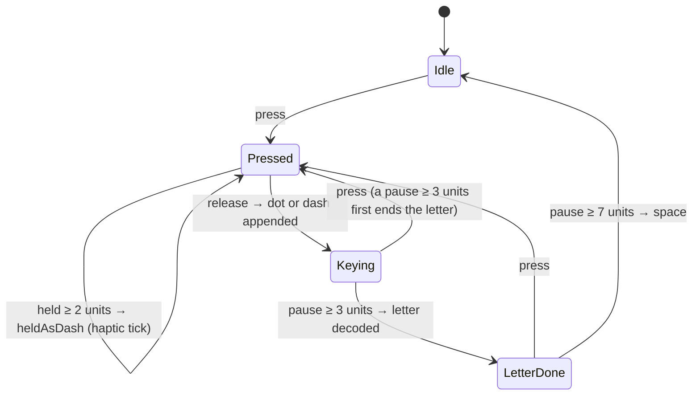

# 16. Tap Morse

The **Tap** tab turns the screen into a straight key: tap for a dot, hold for a dash, and the
pauses between presses decide where letters and words end, as in real hand-sent Morse.

```
┌──────────────────────────┐
│ Tap                      │
│ ┌──────────────────────┐ │
│ │ HELLO WOR            │ │  decoded text (a live region for screen readers)
│ │ •••• • •−•• •−•• −−− │ │  its Morse
│ │ Keying  •−•          │ │  the letter being keyed
│ └──────────────────────┘ │
│          ⌫   ✕   ⧉   ⤴  │  delete, clear, copy, share
│ ┌──────────────────────┐ │
│ │      TAP · HOLD      │ │  MorseKey: DOT while held, DASH past the threshold
│ └──────────────────────┘ │
│       − 8 WPM +          │  tap speed, and what it means in ms
└──────────────────────────┘
```

## From presses to text: `TapDecoder`

`core/tap/TapDecoder.kt` is a pure state machine. Every call takes the time (`now`, monotonic
milliseconds), so tests use fake time, like the flashlight runner ([note 9](09-flashlight.md)).



| Rule (1 unit = 1200 ms / tap WPM) | At the default 8 WPM | Why |
| --- | --- | --- |
| A press of **2 units** or more is a dash | 300 ms | Halfway between a dot (1) and a dash (3) |
| A pause of **3 units** ends the letter | 450 ms | The standard letter gap: forgiving for fingers that hesitate inside a letter |
| A pause of **7 units** ends the word | 1050 ms | The standard word gap |

- **Tap speed is separate from playback speed.** Tapping a screen is slower than keying,
  especially when learning, so it defaults to 8 WPM (`settings.tapWordsPerMinute`), with the
  same − / + ladder as the Transmit menu (`SpeedStepper`, `core/timing/SpeedSteps.kt`). The screen
  shows what the speed means in milliseconds.
- **No polling.** `nextDeadline()` says when something can change next (a hold becoming a dash,
  a letter or word ending). `TapRoute` waits exactly that long in a `LaunchedEffect`, then calls
  `advance()`. A late wake-up still does the right thing, and a press after a pause ends the
  previous letter itself.
- **Unknown codes** (`......`) become `�`, like the translator.
- **Manual edits cancel pending breaks.** Delete, Clear, End letter and Space clear `releasedAt`,
  so, for example, a space you just deleted doesn't come straight back when the word-gap timer
  fires. Automatic breaks resume with the next press. (Found while writing the tests; there's a
  test for it.)

## The key: `MorseKey`

| Concern | How |
| --- | --- |
| Down and up | `pointerInput { awaitEachGesture { awaitFirstDown(); …; waitForUpOrCancellation() } }`: a cancelled touch also releases, so the key can't stick |
| Feedback | Colour: container → primary while held → tertiary once it's a dash. Haptics: `KeyboardTap` on each press, `GestureThresholdActivate` when a hold becomes a dash. Compose haptics follow the system's touch-feedback setting and need no permission |
| Screen readers | Timing can't work with a double-tap, so the key is a button whose click adds a **dot**, with actions **Dash**, **End letter** and **Space** (`customActions`). These add elements without starting the pause timers, so there's no rush |

## Sharing

Copy puts the plain text on the clipboard. Share sends the same "reveal" message as the
translator's Morse → Text (`revealMessage()` in `ShareMessage.kt`), with the tapped Morse.

## Tests

| Test | Covers |
| --- | --- |
| `TapDecoderTest` (18) | Thresholds per speed, dot/dash at the exact threshold, letter and word gaps, late advance, press after a pause, a whole sentence with its Morse, unknown codes, deadlines, one space at most, manual edits, backspace through letters and spaces, clear with a held key |
| `TapViewModelTest` (6) | The saved tap speed, keying with a fake clock, `heldAsDash`, faster speeds, screen-reader actions, delete and clear |
| `SettingsRepositoryTest` | The tap speed's default, persistence, clamping and reset |
