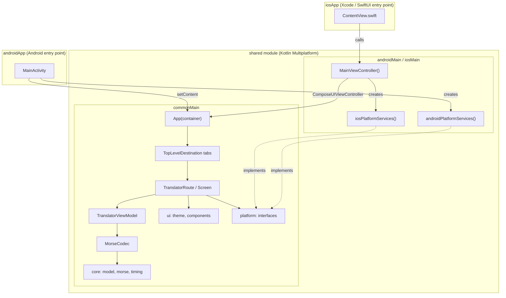

# MorseKit learning notes

Personal notes on how MorseKit works, and on the Kotlin Multiplatform (KMP) and Compose
Multiplatform (CMP) concepts it uses. Every example points at real code in this repo, so you can
open the file and follow along.

## Reading order

| # | Note | What you'll learn |
| --- | --- | --- |
| 1 | [KMP project structure](01-kmp-project-structure.md) | Modules, targets, source sets, how Android and iOS consume `shared`, Gradle setup |
| 2 | [Morse engine](02-morse-engine.md) | How text becomes Morse and back: alphabet, normalization, tokenizing, the codec, error reporting |
| 3 | [Timing and signals](03-timing-and-signals.md) | How Morse is turned into on/off durations, used by audio, flashlight and vibration |
| 4 | [Compose UI and state](04-compose-ui-and-state.md) | Composables, state, recomposition, ViewModel, unidirectional data flow, theming, resources |
| 5 | [Platform services](05-platform-services.md) | Calling Android and iOS APIs from shared code: interfaces vs `expect`/`actual`, Kotlin/Native interop |
| 6 | [Testing](06-testing.md) | `commonTest`, which platforms run which tests, how the engine tests are organized |
| 7 | [Versioning and builds](07-versioning-and-builds.md) | SemVer from one file for both platforms, the bump script, named APK/AAB outputs, the AGP Variant API |
| 8 | [Audio playback](08-audio-playback.md) | Rendering Morse to PCM in shared code, drift-free frame timing, click-free tones, AudioTrack and AVAudioEngine, main-thread contracts |
| 9 | [Flashlight transmission](09-flashlight.md) | Time-driven torch control without drift, testing suspend code with fake time, safety guards, torch availability |
| 10 | [Vibration transmission](10-vibration.md) | Native vibration patterns, millisecond rounding without drift, the shared `TransmissionRunner`, Core Haptics, permissions |
| 11 | [Translator UI](11-translator-ui.md) | The redesign: direction bar, in-card actions, the Transmit FAB speed dial, one-time flash warning, per-screen headers and insets, the app icon |
| 12 | [Navigation](12-navigation.md) | Navigation 3 with a back stack you own, Material back rules, keeping tab state, `navigationevent` back handlers |
| 13 | [Release builds and Google Play](13-ci-release.md) | GitHub Actions builds signed APK/AAB for a release, uploads to Play's closed test, approved promotion to production, a dependency-free Play API client |
| 14 | [Landing page](14-landing-page.md) | The `web/` site: Vite, React and Tailwind next to the app, a TypeScript port of the engine kept in sync by tests, Web Audio timing |
| 15 | [Accessibility](15-accessibility.md) | Morse spoken as dots and dashes, headings, announced values, one stop per action, 48 dp targets, font scaling, how to test with TalkBack |
| 16 | [Tap Morse](16-tap-morse.md) | Keying by hand in Timing or Buttons mode: a pure decoder with fake time, thresholds from a tap speed, deadlines instead of polling, haptics, a letter preview, screen-reader actions |
| 17 | [Morse trainer](17-trainer.md) | The Koch method in Listen and Key modes: an order, an unlock rule, weighted questions, sessions with a summary, defensive persistence, a view model without coroutines |
| 18 | [History](18-history.md) | Saving translations on use, favourites, a JSON-free codec, a store kept out of backups on both platforms, the first detail screen |

## The whole app on one page

**Key rule:** arrows only point *inward*, toward `core`. `core` doesn't know Compose, Android or
iOS exist, which is why it's easy to test and reuse.

## Package map

| Package (under `in.geekofia.morsekit`) | Layer | Depends on | Notes |
| --- | --- | --- | --- |
| `core.model` | Domain models | nothing | Immutable data classes and enums |
| `core.morse` | Engine | `core.model` | Pure Kotlin, no Compose |
| `core.timing` | Engine | `core.model` | Pure Kotlin, uses `kotlin.time.Duration` |
| `core.settings` | Preferences | `core.timing`, `platform` | `AppSettings`, `ThemeMode`, `SettingsRepository` (StateFlow + persistence) |
| `core.audio` | Engine | `core.timing`, `platform` | Tone schedule, PCM renderer, playback state machine |
| `core.torch` | Engine | `core.timing`, `platform` | `TorchPlan` (on/off at time t) and the drift-free torch runner |
| `core.vibration` | Engine | `core.timing`, `platform` | `VibrationPattern` (whole pattern in ms) and its runner |
| `platform` | Abstractions | nothing | Interfaces only in `commonMain` |
| `ui.theme`, `ui.components` | Design system | Compose, `core.model` | Reusable, feature-agnostic |
| `feature.*` | Features | everything above | Screen + ViewModel + UI state |
| `navigation` | App shell | Compose resources | Bottom-bar destinations |
| root (`App.kt`, `AppContainer.kt`) | App shell | everything | App-scoped objects, theme, navigation, features |

## Glossary

| Term | Meaning |
| --- | --- |
| **KMP** | Kotlin Multiplatform: one Kotlin codebase compiled for several platforms (here JVM/Android and Kotlin/Native/iOS). |
| **CMP** | Compose Multiplatform: JetBrains' port of Jetpack Compose, so the same UI code runs on Android and iOS. |
| **Target** | A platform the code is compiled for, e.g. `iosArm64`, `iosSimulatorArm64`, `android`. |
| **Source set** | A folder of code compiled for a group of targets, e.g. `commonMain`, `iosMain`. |
| **Composable** | A `@Composable` function that describes UI from state. |
| **Recomposition** | Compose re-running composables whose inputs changed. |
| **UDF** | Unidirectional data flow: state flows down, events flow up. |
| **Unit** | The basic Morse time slot; a dot lasts 1 unit, a dash 3. |
| **WPM** | Words per minute, measured with the standard word "PARIS" (50 units). |

## Recipe: adding a new feature (e.g. Trainer)

1. Put the pure logic in `core/` (or a new `core/<thing>` package) with tests in `commonTest`.
2. Create `feature/trainer/` with `TrainerUiState` (data class), `TrainerViewModel`, and a
   `TrainerRoute` + stateless `TrainerScreen`.
3. Add an entry to `TopLevelDestination` and a branch in `App.kt`'s `when (destination)`.
4. If it needs a platform API, add an interface under `platform/`, implement it in `androidMain`
   and `iosMain`, and add it to `PlatformServices`.
5. Test the ViewModel in `commonTest` (see `TranslatorViewModelTest`).
